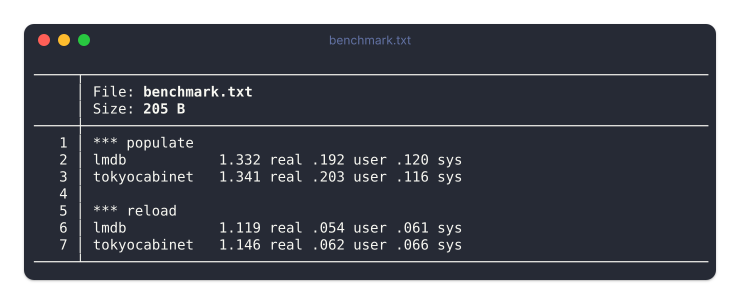

# My Neomutt Config

## Setting up password management

## Base Neomutt/Mutt config to Get Started

```muttrc
# Identity
set realname = "Soham Chatterjee"
set from = "soham.chatterjee@tifr.res.in"

# Receive mail directly through IMAP
set folder = "imaps://soham.chatterjee%40tifr.res.in@tifr.res.in:993/"
set spoolfile = "+INBOX"
set imap_user = "soham.chatterjee@tifr.res.in"
set imap_pass = "`gpg -q --decrypt ~/.config/neomutt/tifr.gpg`"

# Server folders
set postponed = "+Drafts"
set record = "+Sent"
set trash = "+Trash"

# Send mail directly through SMTP
set smtp_url = "smtp://soham.chatterjee%40tifr.res.in@tifr.res.in:25/"
set smtp_pass = "`gpg -q --decrypt ~/.config/neomutt/tifr.gpg`"
set ssl_starttls = yes
set ssl_force_tls = yes

# Compose messages
set editor = "nvim"
```

## Setting Up Offline Email (Mbsync)

## Sending Mails (MSMTP)

## Fast Searching Mails (Notmuch)

## Mailsync Service

## Benchmark Comparison



So lmdp is overall gives better performance

