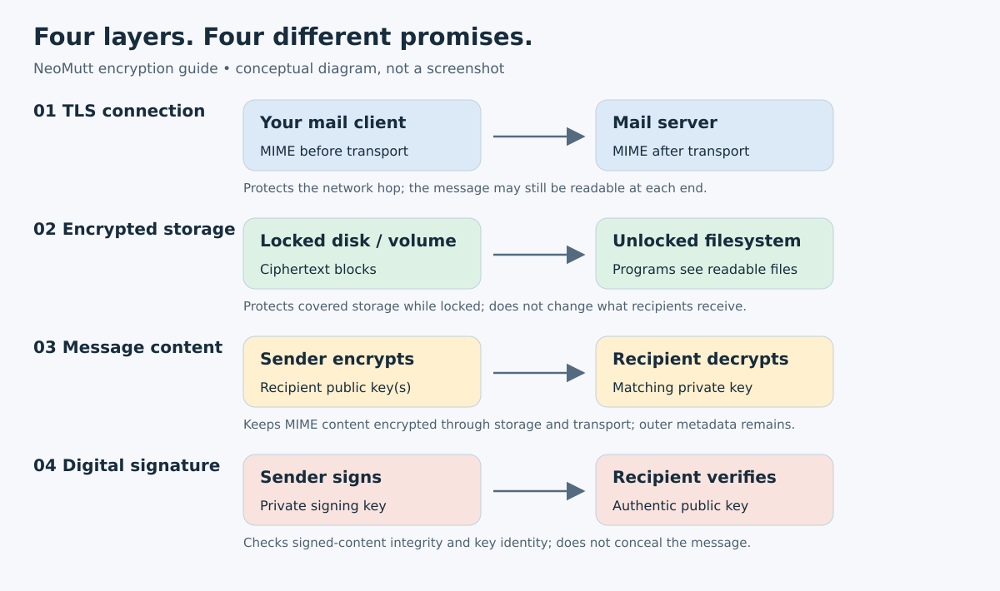
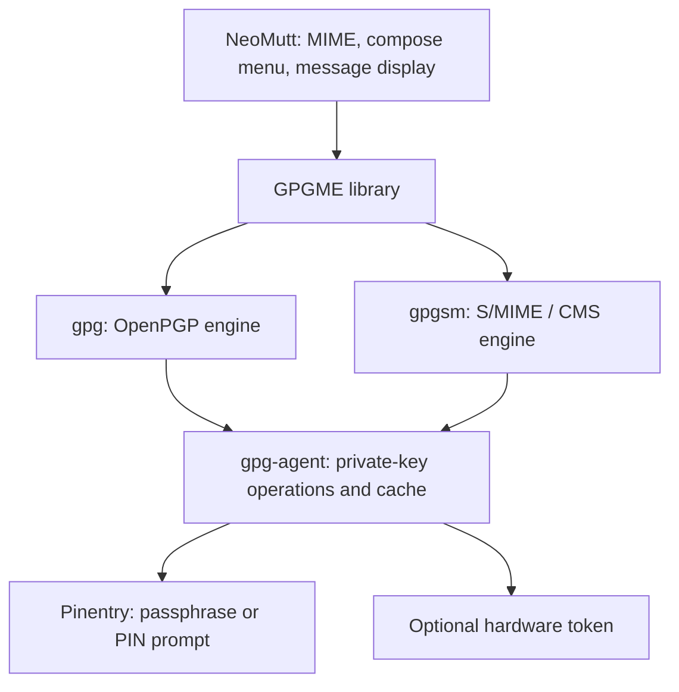
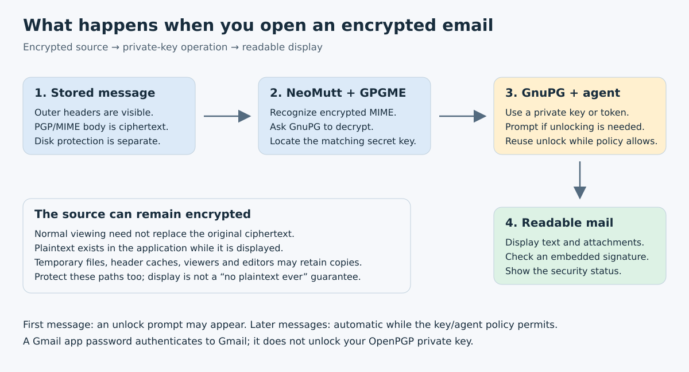
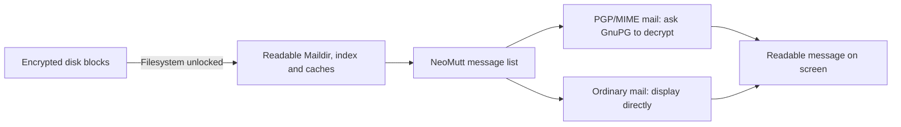
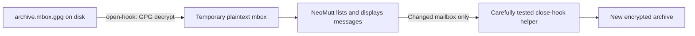
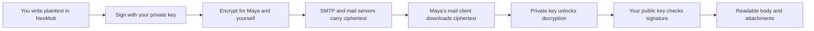
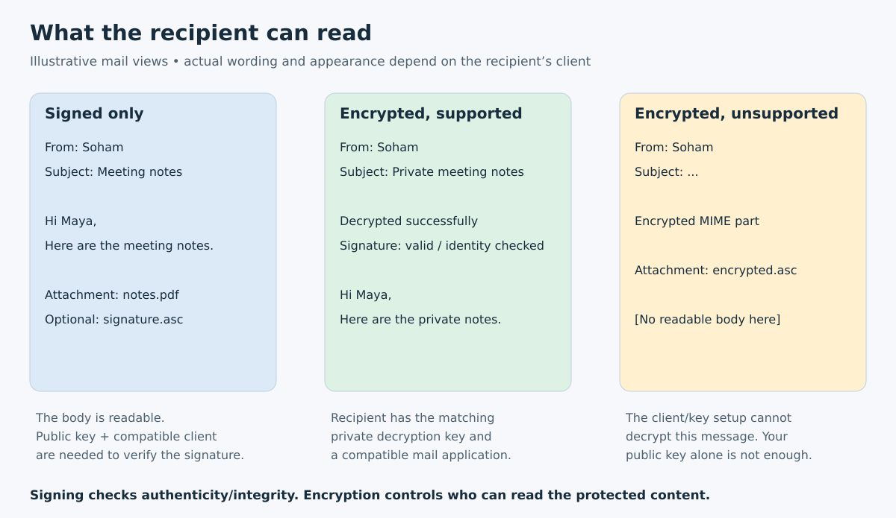

# NeoMutt encryption, signing, and encrypted local mail

_A practical handbook for Soham — prepared 6 October 2026._

**Version basis:** NeoMutt **20260616**, GnuPG **2.4.9**, and NeoMutt's compiled GPGME **2.0.1** support on this computer. Configuration defaults and the option inventory below were checked against the installed manual and a clean configuration. Examples are instructions for future use; preparing this document did **not** change your mail configuration, keys, messages, or disk encryption.

> **The central answer:** You can open encrypted messages in NeoMutt and have it decrypt and display them after your key is unlocked. You can also sign outgoing messages so that recipients can still read them without decrypting anything. However, enabling GPG does **not** automatically encrypt all the ordinary incoming mail already stored on your computer. To achieve that broader goal, you need encrypted storage, an encrypted mailbox container, or a deliberately designed message-encryption pipeline.

This guide separates those jobs, explains the recipient's experience, and provides a reference to **every canonical `crypt_*`, `pgp_*`, `smime_*`, and `autocrypt*` variable in your installed release**, plus the related storage, draft, forwarding, TLS, and search settings. It is not a catalog of unrelated NeoMutt settings such as sidebar width or color names. Newer releases can add, rename, or remove options.

**Contents**

- [1. What you want, translated into separate requirements](#1-what-you-want-translated-into-separate-requirements)
- [2. The different kinds of encryption and keys](#2-the-different-kinds-of-encryption-and-keys)
- [3. GPG, GPGME, S/MIME, and the classic backend](#3-gpg-gpgme-smime-and-the-classic-backend)
- [4. Opening encrypted mail and automatic decryption](#4-opening-encrypted-mail-and-automatic-decryption)
- [5. A practical GPGME/OpenPGP setup](#5-a-practical-gpgmeopenpgp-setup)
- [6. Commands outside NeoMutt: files, signatures, backups, and armor](#6-commands-outside-neomutt-files-signatures-backups-and-armor)
- [7. Keeping mail encrypted on your own machine](#7-keeping-mail-encrypted-on-your-own-machine)
- [8. What signing and encryption mean to the person receiving your message](#8-what-signing-and-encryption-mean-to-the-person-receiving-your-message)
- [9. Illustrations of what you and your correspondent might see](#9-illustrations-of-what-you-and-your-correspondent-might-see)
- [10. Client compatibility: plan with the recipient before encrypting](#10-client-compatibility-plan-with-the-recipient-before-encrypting)
- [11. MIME, attachments, and old inline PGP](#11-mime-attachments-and-old-inline-pgp)
- [12. Subjects, metadata, and what the mail provider still learns](#12-subjects-metadata-and-what-the-mail-provider-still-learns)
- [13. Trust, invalid signatures, and misleading security indicators](#13-trust-invalid-signatures-and-misleading-security-indicators)
- [14. Autocrypt and opportunistic encryption](#14-autocrypt-and-opportunistic-encryption)
- [15. A recipient-by-recipient adoption plan](#15-a-recipient-by-recipient-adoption-plan)
- [16. S/MIME in practice](#16-smime-in-practice)
- [17. Other encryption tools and boundaries](#17-other-encryption-tools-and-boundaries)
- [18. TLS, authentication, and sending without msmtp](#18-tls-authentication-and-sending-without-msmtp)
- [19. A phased rollout and verification plan](#19-a-phased-rollout-and-verification-plan)
- [20. Troubleshooting by symptom](#20-troubleshooting-by-symptom)
- [21. Reading the exhaustive option reference](#21-reading-the-exhaustive-option-reference)
- [22. Complete version-specific crypto option reference](#22-complete-version-specific-crypto-option-reference)
- [23. Command-line crypto, automation, and unattended reading](#23-command-line-crypto-automation-and-unattended-reading)
- [24. Questions that often cause confusion](#24-questions-that-often-cause-confusion)
- [25. Glossary](#25-glossary)
- [26. Sources, verification scope, and maintaining this guide](#26-sources-verification-scope-and-maintaining-this-guide)

## 1. What you want, translated into separate requirements

| Your goal | What implements it | What it does not do |
| ---------------------------------- | ------------------------------------ | ------------------------------ |
| Someone steals the powered-off computer and cannot read your mail | Full-disk encryption, or a correctly locked encrypted volume/directory | Does not hide mail from your running, unlocked account or from the mail provider |
| Each saved message remains a cryptographic object even when copied elsewhere | Native OpenPGP/MIME or S/MIME message encryption; a special ingestion/archive design for originally clear mail | Does not automatically hide all outer headers or every cache/index |
| Opening an encrypted message feels like opening normal mail | NeoMutt + GPGME/GnuPG or a configured classic crypto backend + unlocked private key | Does not eliminate decrypted data from memory or temporary files |
| Outgoing messages prove they were signed by your key | OpenPGP or S/MIME digital signatures | Signing alone does not hide the message |
| Only intended correspondents can read outgoing content | Encrypt to each recipient's public key/certificate | Their email address alone is not enough to provide a usable key |
| You can later read your encrypted Sent mail | Include your own encryption key as a recipient | Signing with your key does not itself give you decryption access |
| Passwords and contacts are encrypted in your dotfiles repository | GPG-encrypted credential/contact backup files | Does not encrypt the live mailbox or the restored contacts |
| The connection to the IMAP/SMTP server is encrypted | TLS (`imaps://`, SMTP STARTTLS, certificate verification) | TLS normally ends at the provider, which can still read non-E2EE messages |

The most practical combination for your local Maildir workflow is:

1. Protect the filesystem holding mail, indexes, caches, drafts, temporary files, and private keys.
2. Use **GPGME with OpenPGP/MIME** for message-level decryption, signing, and selected encrypted conversations.
3. Sign new outgoing messages if you want routine authenticity without requiring every correspondent to use OpenPGP.
4. Encrypt outgoing content only when every recipient has a usable, verified key; preserve encryption when replying to encrypted mail.
5. Encrypt postponed drafts that are marked for encryption and retain access to encrypted Sent copies; protect ordinary drafts and Sent mail through storage encryption as well.

This is a recommendation for this workflow, not a claim that storage encryption and message encryption offer identical protection.

## 2. The different kinds of encryption and keys

### The layers



_Diagram: each layer protects a different boundary. The fact that one box is encrypted does not make every other box encrypted._

- **Transport encryption:** TLS protects the network connection between two endpoints. IMAP and SMTP authentication passwords travel inside that protected connection when correctly configured.
- **Storage encryption:** the block device, filesystem, directory, archive, or mailbox file is stored as ciphertext. Once mounted or opened, applications can see a normal readable filesystem or mailbox.
- **Message encryption:** the message content is wrapped in an encrypted MIME structure. A mail server can store and forward that ciphertext without owning the recipient's private key.
- **Digital signatures:** a cryptographic signature detects modifications to the signed content and ties it to a signing key. The human identity associated with that key still needs authentication.

A plaintext message on an unlocked LUKS filesystem is plaintext **to programs**, although its disk blocks are encrypted. Conversely, a PGP/MIME message on an unencrypted filesystem can have an encrypted body while its sender, recipients, date, and other metadata remain readable.

### Things that are not interchangeable

| Item | Used for | Share with another person? |
| --------------------------------- | --------------------------------------- | ---------------------------- |
| Gmail/IMAP app password | Logging in to a mail server | No |
| OAuth refresh/access token | Authorizing a mail-client session | No |
| Public OpenPGP key | Others encrypt to you and verify your signatures | Yes, after arranging identity verification |
| Private OpenPGP key | You decrypt and create signatures | No; only controlled backups/your own devices |
| GPG key passphrase | Unlocking locally protected private-key material | No |
| OpenPGP fingerprint | Identifying a particular public key | Yes; compare through an independently trusted channel |
| S/MIME public certificate | Binds an identity to a public key, usually through a certificate chain | Yes |
| S/MIME private key / private-key PKCS#12 bundle | Decryption and signing for that certificate | No |
| LUKS/container unlock secret | Unlocking encrypted storage | No |

Your previous app-password setup and `contacts-gpg.sh` solve the credential/backup rows. Neither one causes received mail to be encrypted automatically.

### How public-key mail encryption works

A practical message is encrypted using a fresh symmetric session key. That session key is then protected for the selected public-key recipients. The recipient uses their private key to recover the session key, and the session key decrypts the content. You do not send the recipient your private key or your GPG passphrase.

If Alice sends the same encrypted message to Bob and Carol, both must have a supported usable public key/certificate selected for them. If Alice also wants to read her Sent copy, Alice's encryption key must be included too. Removing Carol from a later conversation does not revoke her ability to read an earlier message she could already decrypt.

Traditional stored email encryption also does not promise forward secrecy: compromise of a long-lived decryption key can expose retained historical ciphertext for that key. Retain old decryption keys for archival access, but protect them carefully.

### Signing is not “encrypting with the private key”

That phrase is misleading. Signature algorithms operate on a representation/digest of the signed data according to a signature scheme. A signature can be checked with the public key without making the content confidential. Some modern signing algorithms do not support encryption at all.

A valid signature means that the signed content verifies under the signature format’s canonicalization rules and that the signature corresponds to the signing key. It does not prove that the author is honest, that an attachment is safe, that the machine was uncompromised, or that an unverified name attached to a key is genuine.

## 3. GPG, GPGME, S/MIME, and the classic backend

### The software stack



**GnuPG / `gpg`** is the OpenPGP implementation. **GPGME** is an application library that gives NeoMutt a structured way to ask the crypto engines to operate. GPGME is not a separate encryption format, mailbox encryption layer, or replacement for your public/private keys. **`gpgsm`** is the GnuPG engine for S/MIME/CMS. This division is described in the [GPGME introduction](https://gnupg.org/documentation/manuals/gpgme/Introduction.html).

### Backend choices

#### GPGME OpenPGP

**NeoMutt setting:** `crypt_use_gpgme=yes`

**Who performs crypto?:** GPGME talks to `gpg`

**Why choose it?:** Less command-template maintenance; natural choice for modern PGP/MIME

**Main caveat:** Cannot create legacy inline-PGP messages

#### Classic OpenPGP

**NeoMutt setting:** `crypt_use_gpgme=no` plus `pgp_*_command` templates

**Who performs crypto?:** NeoMutt invokes configured commands

**Why choose it?:** Specialized command wrappers, compatibility, inline-PGP creation

**Main caveat:** Correct templates and status/error handling are your responsibility

#### GPGME S/MIME

**NeoMutt setting:** GPGME plus `gpgsm`, certificates, trust setup

**Who performs crypto?:** `gpgsm` through GPGME

**Why choose it?:** Certificate-based correspondence in compatible environments

**Main caveat:** OpenPGP keys do not become S/MIME certificates

#### Classic S/MIME

**NeoMutt setting:** Classic backend plus `smime_*_command` templates

**Who performs crypto?:** Usually OpenSSL and NeoMutt's certificate helper

**Why choose it?:** Existing managed S/MIME setup or specialized workflows

**Main caveat:** Different certificate store and configuration from GPGME

#### Autocrypt

**NeoMutt setting:** `autocrypt=yes`, supported build

**Who performs crypto?:** GPGME and an Autocrypt keyring/database

**Why choose it?:** Opportunistic OpenPGP key discovery and recommendations

**Main caveat:** Not a guarantee of encryption or verified identity


Changing the backend does not convert existing mail. A standards-compatible OpenPGP/MIME message does not care whether the sender used GPGME or classic command templates.

### What was actually found on your machine

| Observation on 6 October 2026 | Consequence |
| --------------------------------------------- | ------------------------------------------------------- |
| Build reports `+gpgme +pgp +smime +autocrypt` | The relevant NeoMutt features are compiled in; runtime engines and setup still matter |
| NeoMutt reports GPGME 2.0.1; `gpg --version` reports 2.4.9 | Modern GnuPG agent handling is available |
| `neomuttrc` explicitly has `set crypt_use_gpgme = no` | Your current configuration selects the classic backend, even though GPGME is compiled in |
| `/usr/bin/gpgsm` is absent; clean startup reports `GPGME: CMS protocol not available` | S/MIME through GPGME needs its engine installed/configured; this is not proof that OpenPGP is unavailable |
| `gpgconf --list-components` lists an expected `gpgsm` path anyway | Listing a component's expected path does not prove the executable exists |
| Current mailbox is `/home/soham/.mail/tifr` | Local storage protection must cover that Maildir and its related files |
| Notmuch and header/body cache paths are configured | Their contents deserve the same storage protection as messages |
| `newmutt` is currently absent | This guide uses the current main configuration as the baseline, not the earlier temporary Gmail file |

An isolated configuration check also confirmed that this NeoMutt accepts `open-hook`, used for encrypted single-file mailbox archives later in this guide. No archive was opened during that syntax check.

Only configuration and program metadata were inspected for this document. Disk encryption, existing message encryption, recipient-key validity, and recovery backups were not audited. A commented or absent setting in your own file can still be affected by system configuration.

## 4. Opening encrypted mail and automatic decryption



### A normal encrypted-message reading session

1. NeoMutt reads the mailbox's outer message headers and recognizes the encrypted MIME structure.
2. You open the message.
3. NeoMutt supplies the encrypted material to the selected backend.
4. The backend locates a suitable private decryption key.
5. If required, `gpg-agent` invokes Pinentry. You supply the **GPG key passphrase or token PIN**, not the IMAP password.
6. The backend returns decrypted content. If the message was also signed, the signature can be verified.
7. NeoMutt renders the content and attachments in the pager.
8. Further decryptions can proceed without another prompt while the agent's cache/key/token policy permits.

For native encrypted MIME mail, ordinary display is the automatic-decryption trigger. There is no general `decrypt_all_incoming_mail_and_encrypt_my_whole_disk` variable. `pgp_auto_decode` is specifically concerned with traditional inline PGP and is not the master switch for PGP/MIME display.

You can normally leave the message stored as ciphertext while displaying the decrypted content. Do not confuse opening it with choosing a **decrypt-copy** or **decrypt-save** operation, which deliberately writes a decrypted version elsewhere.

### What “automatic” does and does not mean

- It can mean “enter a passphrase once this session, then read subsequent encrypted mail naturally.”
- It does not mean “the private key can never become locked” or “decryption succeeds without having the right private key.”
- A missing secret encryption subkey, wrong keyring, unavailable hardware token, or broken Pinentry can interrupt opening. Expired/revoked keys can generally still decrypt historical mail when the required private material is available; validity warnings and decryption ability are different.
- Plaintext must exist somewhere while it is shown. NeoMutt and helper programs may use memory and temporary files; terminal scrollback, screenshots, editor state, and external attachment viewers can retain further copies.
- Screen-locking does not necessarily unmount storage or clear an agent's cache. Suspending a laptop can preserve useful decryption state in memory.
- The first display can reveal a protected Subject to the index/header cache. “The original `.eml` is still encrypted” is not the same as “no plaintext metadata was stored anywhere.”

### Agent and Pinentry setup

In an interactive terminal, set:

```sh
export GPG_TTY=$(tty)
```

For shells that also run noninteractively, a shell startup file can guard this:

```sh
if [ -t 0 ]; then
    export GPG_TTY=$(tty)
fi
```

NeoMutt's installed manual recommends a GUI or curses Pinentry rather than the basic `pinentry-tty` implementation. Discover an installed suitable program before placing its path in `/home/soham/.gnupg/gpg-agent.conf`. An example agent configuration is:

```conf
# Examples, not settings applied by this guide.
# pinentry-program /actual/path/to/pinentry-curses

default-cache-ttl 600
max-cache-ttl 7200
```

Reload after intentionally editing it:

```sh
gpgconf --reload gpg-agent
```

The first timeout is an inactivity-based cache lifetime, while the second caps the lifetime despite repeated use. These example values are also GnuPG's documented defaults. An external desktop credential cache may change the prompting experience; `no-allow-external-cache` asks Pinentry not to use one. `ignore-cache-for-signing` requests a fresh signing authorization instead of reusing the normal cache. [GnuPG agent options](https://www.gnupg.org/documentation/manuals/gnupg/Agent-Options.html)

To end the agent process and discard its in-process cache:

```sh
gpgconf --kill gpg-agent
```

This affects other programs using that agent, including possible SSH or password-manager integrations; it is not a command to put after each opened message. Hardware-token PIN caching and desktop caches have their own behavior. No cache-clearing command makes already rendered text disappear from every viewer, file, or terminal.

### GPG timeouts versus NeoMutt timeouts

`pgp_timeout` and `smime_timeout` concern NeoMutt's own legacy passphrase handling where applicable. They do not replace modern `gpg-agent` cache settings. With GPGME/GnuPG 2, manage passphrase prompts primarily through the agent and Pinentry. Likewise `<forget-passphrase>` should not be treated as a universal proof that every external agent or hardware cache was emptied.

## 5. A practical GPGME/OpenPGP setup

### Inventory first; do not create a new key unnecessarily

Use your existing key if it is suitable and recoverable. These commands inspect keys without exporting private key material:

```sh
gpg --list-secret-keys --keyid-format LONG --with-subkey-fingerprint
```

```sh
gpg --list-keys --with-subkey-fingerprint
```

Look for signing capability `[S]` and encryption capability `[E]`; certification `[C]` is a different job. The signing and encryption capabilities can belong to different subkeys under one primary identity. A key capable only of signing cannot decrypt mail encrypted for a different encryption key.

Your `gpg-fingerprint` alias can help you find a fingerprint in an **interactive shell**. Confirm which output identifies the mail key; aliases can print multiple primary keys. A bare alias name is not itself a key ID, and NeoMutt's noninteractive command execution may not load your interactive aliases. Put the selected full fingerprint into a NeoMutt key variable, or use an explicit executable helper if you need dynamic selection.

In the examples below, `YOUR_FULL_OPENPGP_FINGERPRINT` and `RECIPIENT_FULL_FINGERPRINT` are placeholders. Do not paste them unchanged and expect a working key.

If you genuinely need a new key, the interactive starting point is:

```sh
gpg --full-generate-key
```

Choose supported modern parameters appropriate for your correspondents; a current default is usually a better starting point than forcing obsolete algorithms. Keep the key passphrase distinct from a mail-server password. Key creation is not required merely because you changed from classic NeoMutt to GPGME.

### Public-key exchange and identity checks

Export **only the public key** for sharing:

```sh
gpg --armor --output my-mail-public-key.asc --export YOUR_FULL_OPENPGP_FINGERPRINT
```

Inspect a correspondent's key file before importing it:

```sh
gpg --show-keys --with-fingerprint correspondent-public-key.asc
```

Then, after establishing that it is the expected key:

```sh
gpg --import correspondent-public-key.asc
```

```sh
gpg --fingerprint RECIPIENT_FULL_FINGERPRINT
```

Compare the **whole fingerprint** through a channel whose authenticity you already trust. Merely fetching a key from a keyserver or receiving it from the same potentially compromised email account does not establish independent identity. If the person confirms ownership, a local certification can record that judgment:

```sh
gpg --quick-lsign-key RECIPIENT_FULL_FINGERPRINT
```

With no user-ID argument, that command can locally certify multiple user IDs on the key. Verify every identity it will certify, or specify the intended user ID as an additional argument. Use local certification only after verifying identity; it is not a generic way to silence warnings. Ownertrust describes how much you trust a key owner to certify **other** identities and should not be confused with validating that person's own key. Do not set everyone's ownertrust to “ultimate.” See [GnuPG key-management commands](https://www.gnupg.org/documentation/manuals/gnupg/OpenPGP-Key-Management.html).

If you send as multiple addresses, use keys/user IDs deliberately. A signature can be mathematically valid while a recipient warns that its claimed identity does not match the From address. Do not assume that the email used for a GPG backup key is automatically the correct signing identity for every mail account.

### Baseline: sign outgoing mail, decrypt incoming mail, encrypt selected conversations

This is an **example configuration**, not an applied edit. It uses canonical names accepted by the installed release:

```muttrc
# Select this at startup, then restart NeoMutt.
set crypt_use_gpgme = yes

# OpenPGP identities. Usually the same primary fingerprint is sufficient.
set pgp_default_key = "YOUR_FULL_OPENPGP_FINGERPRINT"
set pgp_sign_as = "YOUR_FULL_OPENPGP_FINGERPRINT"
set crypt_auto_pgp = yes
set smime_is_default = no

# Sign new outgoing messages. Do not demand encryption for every stranger/list.
set crypt_auto_sign = yes
set crypt_auto_encrypt = no
set crypt_opportunistic_encrypt = no

# Preserve encryption when replying; sign those replies as well.
set crypt_reply_encrypt = yes
set crypt_reply_sign = yes
set crypt_reply_sign_encrypted = yes
set crypt_verify_sig = yes

# Retain access to encrypted Sent messages and avoid a deliberately clear Fcc.
set pgp_self_encrypt = yes
set fcc_clear = no

# Self-encrypt postponed messages that are marked for encryption.
set postpone_encrypt = yes

# Protected Subject support; outer Subject hidden only for encrypted messages.
set crypt_protected_headers_read = yes
set crypt_protected_headers_write = yes
set crypt_protected_headers_save = no
set crypt_protected_headers_subject = "Encrypted message"

# Keep recognizable crypto-status information in the pager.
set crypt_timestamp = yes
set crypt_encryption_info = yes
```

**What this baseline accomplishes:** signed ordinary outgoing mail, automatic handling of supported encrypted incoming MIME, encrypted replies when applicable, self-encryption for postponed drafts marked for encryption, and access to your own encrypted Sent messages.

**What it does not accomplish:** encrypting every ordinary incoming message or every draft, encrypting signed-only Sent mail, guaranteeing recipient key availability, protecting the whole Notmuch database, or protecting plaintext while your computer is unlocked. Storage encryption remains the solution for the broad local-at-rest requirement.

`pgp_self_encrypt=yes` adds your key to messages that are being encrypted; it does not change every signed-only or unencrypted message into an encrypted one. Similarly `fcc_clear=no` preserves message-level protection already present; it is not an independent “encrypt all Sent” switch.

The protected-header settings can expose decrypted Subjects in a header cache despite `crypt_protected_headers_save=no`. Put that cache on protected storage or disable persistent caching if this metadata matters more than performance.

### Sending one signed-only message

1. Compose the message normally, including attachments.
2. In the compose screen, open `<pgp-menu>` (normally `p`, unless remapped).
3. Select signing only. Inspect the security status before sending; the exact option letters vary with backend/menu state.
4. Confirm that **signing is on and encryption is off**.
5. Send. The backend may ask you to unlock the signing key.
6. The recipient normally sees the message body as readable text. A compatible client can verify your signature; an unsupported client may present the detached signature as an attachment.

A message signature is unrelated to your text footer configured by NeoMutt's `signature` option. A footer like “Regards, Soham” provides no cryptographic authentication.

### Sending one encrypted-and-signed message

1. Obtain and verify a usable encryption key for **every To/Cc/Bcc recipient**.
2. Compose the body and attach files normally.
3. Use `<pgp-menu>` to select signing plus encryption.
4. Review recipients, the actual selected keys, the sending identity, and the security status. Adding a person can change the availability of encryption.
5. Ensure self-encryption is configured if you want to read your Sent copy.
6. Send only after the compose screen indicates the intended protection.
7. The recipient's client needs its matching private key and support for the MIME format. A key received in a signed message is a public key; it cannot decrypt ciphertext intended for that recipient.

Do not send your private key or passphrase to “help them open it.” If they lack a private key for the selected public key, the right remedy is to establish the correct recipient key and resend appropriately.

### Encrypting whenever possible versus requiring encryption

For opportunistic encryption:

```muttrc
set crypt_opportunistic_encrypt = yes
set crypt_opportunistic_encrypt_strong_keys = yes
```

“Strong” here refers to NeoMutt/GPGME's **key-validity/trust classification**, not a minimum RSA bit count or symmetric cipher strength. This policy can result in unencrypted mail when qualifying keys are unavailable. It is useful for convenience, not for a rule that confidential messages must never go out in cleartext.

For a message or account where encryption is a requirement, use explicit encryption and treat any failure as a reason to stop. `crypt_auto_encrypt=yes` requests it by default, but users and hooks can still change compose settings. Check the final security status. Do not add a fallback command that resends in plaintext automatically after a crypto error.

### Why choose classic GPG instead?

The classic backend is useful when you already maintain tested command wrappers or must send traditional inline-PGP mail. It requires a coherent set of command templates, including machine-readable GnuPG status handling. Do not copy a random single `pgp_decrypt_command` and assume signature verification, recipient selection, key import/export, and error detection are covered.

Start from the [NeoMutt contributed configurations](https://github.com/neomutt/neomutt/tree/main/contrib) appropriate to your installed release, review the relevant `gpg.rc`, then source your reviewed local copy:

```muttrc
# Alternative to GPGME, not an extra layer on top of it.
set crypt_use_gpgme = no
source "/absolute/path/to/your/reviewed/gpg.rc"
set pgp_default_key = "YOUR_FULL_OPENPGP_FINGERPRINT"
```

That path is intentionally a placeholder. The catalog later in this guide explains every command variable and its expansion tokens. When `crypt_use_gpgme=yes`, most classic `pgp_*_command`/`smime_*_command` settings are not the commands performing normal message crypto.

## 6. Commands outside NeoMutt: files, signatures, backups, and armor

These examples explain the primitives. They do not construct an entire PGP/MIME email or teach NeoMutt to treat an arbitrary encrypted blob as a Maildir message.

### Encrypt a file to yourself

```sh
gpg --output notes.txt.gpg --encrypt --recipient YOUR_FULL_OPENPGP_FINGERPRINT notes.txt
```

The original `notes.txt` still exists. Creating an encrypted copy does not erase the original, old backups, snapshots, editor files, or filesystem journal copies. Encryption with a public key normally does not require unlocking the private key.

### Decrypt a file

```sh
gpg --output recovered-notes.txt --decrypt notes.txt.gpg
```

This creates plaintext on disk. To display text instead:

```sh
gpg --decrypt notes.txt.gpg
```

That prints plaintext into your terminal and possibly scrollback. Neither command should be used on a real secret merely to produce a screenshot for troubleshooting.

### Encrypt for somebody else and for your own archive

```sh
gpg --output shared-document.pdf.gpg --encrypt \
    --recipient RECIPIENT_FULL_FINGERPRINT \
    --recipient YOUR_FULL_OPENPGP_FINGERPRINT \
    shared-document.pdf
```

Either corresponding private key can decrypt the result. This is similar in purpose to NeoMutt's self-encryption behavior, but the file command does not create the email MIME envelope automatically.

### Sign without hiding a file

```sh
gpg --armor --local-user YOUR_FULL_OPENPGP_FINGERPRINT \
    --detach-sign --output report.pdf.asc report.pdf
```

Send both the original and detached signature. Verification requires both files and the authentic public key:

```sh
gpg --verify report.pdf.asc report.pdf
```

For a readable text document, `--clear-sign` creates an inline clear-signed representation. For general files, `--sign` produces a signed OpenPGP object that needs processing to recover/view the content; it is not the same as an immediately readable PGP/MIME detached-signed message. NeoMutt handles the appropriate MIME structure when signing mail. [GnuPG operational commands](https://www.gnupg.org/documentation/manuals/gnupg/Operational-GPG-Commands.html)

### Symmetric encryption

```sh
gpg --symmetric --output private-notes.txt.gpg private-notes.txt
```

Both sides need the shared passphrase. It is useful for a one-off archive, but requires a separate secure channel to convey that passphrase and is not the usual public-key workflow behind NeoMutt's PGP recipient menu. A password-encrypted ZIP or `age`-encrypted attachment is likewise an attachment-level arrangement, not transparent native OpenPGP/MIME mail support.

### ASCII armor

Add `--armor` to produce printable text such as a `.asc` file rather than binary ciphertext. The security is the same for equivalent packet contents; armor is a transport encoding. It is useful for public-key exchange, text-only transport, and copy/paste. It is larger, and it does not make encrypted Git diffs reveal meaningful contact edits.

For your contact backups, binary `.gpg` output is reasonable. Restoring those contacts creates plaintext working files again. The restored aliases and abook database still need filesystem/backup protection.

### Backup and recovery planning

A public-key backup alone cannot recover encrypted mail after all private-key copies are lost. Keep controlled backups of the required private keys or an appropriate recovery design, their passphrases where applicable, revocation material, and the information needed to restore trust/settings. Hardware tokens also need a recovery plan; moving a key onto a token without a prior usable backup can make a lost token a permanent archive-loss event.

A conceptual private-key backup command is:

```sh
# This file is PRIVATE KEY MATERIAL. Store only on protected offline media.
gpg --output /path/to/protected-offline-media/mail-secret-keys.gpg \
    --export-secret-keys YOUR_FULL_OPENPGP_FINGERPRINT
```

If the key exists only on a hardware token, an export may contain a reference/stub rather than the secret material needed for recovery; it cannot extract a non-exportable token key. Verify the recovery procedure, not merely that an export file exists.

The `.gpg` filename does not itself guarantee an additional outer encryption layer. Preserve protected private-key material and treat the export as a secret regardless of extension. Do not put it in a public dotfiles repository. Test restoration in a separate, controlled keyring before relying on a backup; test keys and throwaway messages can exercise the process without exposing actual correspondence.

Expiry and revocation primarily influence whether a key should be used/trusted for new operations. Keep old secret encryption subkeys necessary for your archive; do not delete them simply because a newer key exists. Recipients may have cached older public keys, so distribute updates deliberately.

## 7. Keeping mail encrypted on your own machine

Your requirement has two possible meanings, and they lead to different designs:

1. **A person who steals or removes my disk should not be able to read my mail.** Use encrypted storage for the whole mail environment. NeoMutt continues to see ordinary Maildir files while you are logged in and the storage is unlocked.
2. **Each stored message must remain a cryptographic object even while my filesystem is unlocked.** Store messages as valid encrypted email, or use an encrypted archive opened through a mailbox hook. This requires more care with searching, temporary files, drafts, keys, and synchronization.

Neither design can let NeoMutt show you a message while making the plaintext unavailable to every other process with equivalent access to your session. At some point plaintext must exist in memory, and often in temporary files or an editor. Encryption reduces exposure at specific boundaries; it does not make readable text unreadable to an already-compromised desktop.

### Comparison of storage designs

#### LUKS/dm-crypt filesystem or whole-system encryption

**What is encrypted on persistent storage?:** Filesystem blocks in the covered volume, including filesystem metadata

**What NeoMutt sees when reading:** Ordinary mail files after the volume is unlocked

**Main benefit:** Covers ordinary incoming mail, indexes, caches, and drafts if all reside inside the protected volume

**Main limitation:** Mounted files remain readable under normal OS permissions; files outside the volume are not covered

#### An fscrypt-encrypted mail directory

**What is encrypted on persistent storage?:** File content and names under the encrypted policy

**What NeoMutt sees when reading:** Ordinary mail files while unlocked

**Main benefit:** Can lock selected directories separately

**Main limitation:** Does not hide all filesystem metadata; every cache/index outside it still needs protection

#### Individual PGP/MIME or S/MIME email

**What is encrypted on persistent storage?:** The encrypted MIME content of each message

**What NeoMutt sees when reading:** A normal message envelope plus encrypted content, decoded when opened

**Main benefit:** Encryption travels with the message and can survive copying to another disk

**Main limitation:** Ordinary incoming mail is not converted automatically; outer headers still expose metadata

#### GPG-encrypted single-file mbox opened with hooks

**What is encrypted on persistent storage?:** The complete archive file when closed

**What NeoMutt sees when reading:** A temporary decrypted mbox

**Main benefit:** Useful for a cold archive that you open occasionally

**Main limitation:** The whole archive is temporarily plaintext; updates rewrite the archive; poor fit for a busy Maildir/Notmuch workflow

#### Encrypted backup archive

**What is encrypted on persistent storage?:** The backup copy

**What NeoMutt sees when reading:** Nothing until you restore it

**Main benefit:** Portable, separately protectable recovery copy

**Main limitation:** Does not encrypt the live mailbox


These methods can be combined. For example, PGP/MIME messages in a Maildir on LUKS preserve message encryption while LUKS additionally protects headers, indexes, drafts, and ordinary unencrypted mail. The [Linux fscrypt documentation](https://www.kernel.org/doc/html/next/filesystems/fscrypt.html) and [fscrypt project's comparison](https://github.com/google/fscrypt#alternatives-to-consider) explain the filesystem/block distinction.

### The most natural fit for your current Maildir and Notmuch setup

Your inspected configuration points at these locations:

#### TIFR mail

**Current configured location:** `/home/soham/.mail/tifr`

**What needs protection:** Message bodies, attachments, unprotected headers, Maildir filenames, flags

#### Header cache

**Current configured location:** `/home/soham/.cache/neomutt/headers`

**What needs protection:** Senders, recipients, dates, subjects, other cached message metadata

#### Message cache

**Current configured location:** `/home/soham/.cache/neomutt/bodies`

**What needs protection:** Cached copies when remote IMAP/POP mail is accessed

#### Temporary files

**Current configured location:** `/home/soham/.cache/neomut/temp`

**What needs protection:** Decoded content and temporary working files; the single `t` in `neomut` reflects the configured spelling

#### Notmuch configuration

**Current configured location:** `/home/soham/.config/neomutt/notmuch-config`

**What needs protection:** The database location and indexing policy; configuration itself is not the message index

#### Default Notmuch URL

**Current configured location:** `notmuch:///home/soham/.mail/tifr`

**What needs protection:** The actual Notmuch database and its parent filesystem must be included in the storage plan


These are configuration observations, not a statement that the underlying disk is currently encrypted. No mail or private-key contents were opened to produce this guide.

For this arrangement, a useful starting architecture is: encrypted home/system storage, plus GPGME for message-level OpenPGP, with the Notmuch database, caches, editor files, and drafts kept inside protected storage. This preserves your normal sidebar, virtual folders, and searches. Encrypting only `~/.mail/tifr` leaves the two cache locations and temporary directory outside that boundary unless their containing filesystem is also encrypted.



**What you experience:** unlock storage at boot/login or mount time; open NeoMutt; read ordinary mail normally. Open an encrypted email and GnuPG may ask for the private-key passphrase separately. These are distinct unlocks. Unlocking the disk does not necessarily unlock your GPG key, and unlocking the GPG key does not mount an encrypted filesystem.

**What your correspondent experiences:** absolutely nothing changes merely because you enabled local disk encryption. They receive whichever outgoing message you sent: plain, signed, encrypted, or signed-and-encrypted. Local storage protection is not advertised to them and does not require their key.

### LUKS, fscrypt, and encrypted mounts

**LUKS/dm-crypt** is suited to a whole filesystem or a dedicated encrypted mail volume. It works beneath mail applications. A separate volume allows a workflow of unlock → mount → start mail tools → stop mail tools → unmount → close the encrypted mapping. A boot-unlocked home filesystem prioritizes convenience; a separately locked mail volume gives a smaller period during which mail is available. [Linux dm-crypt overview](https://docs.kernel.org/admin-guide/device-mapper/dm-crypt.html)

**fscrypt** applies encryption policy to directories on supported filesystems. It is useful when independent directory keys are valuable. Plan a new encrypted directory and a verified migration: do not assume toggling a setting retroactively encrypts an existing populated mail tree. Its protection does not include every size, timestamp, or other metadata item. [fscrypt usage and migration](https://github.com/google/fscrypt#encrypting-existing-files)

**A mounted encryption layer** can provide the same application-facing idea: one ciphertext location and one unlocked directory view. NeoMutt must point at the unlocked view. Select and configure a maintained filesystem tool with reliable locking, rename, and durability semantics appropriate for mail. A compressed GPG file is not itself a filesystem mount.

Before any actual migration, map all writers: NeoMutt, mbsync, Notmuch, delivery jobs, editors, preview tools, backup jobs, and desktop indexers. Pause writers for the copy, verify a separate backup, verify the copied messages and index, then switch paths. Ensure scheduled synchronization refuses to run when the intended volume is absent; otherwise an ordinary empty mountpoint directory can become a new unencrypted mail store. Do not format an existing partition or move/delete the only mail copy using a generic example from a guide.

Locking the screen is not the same as removing a filesystem key. Sleep may keep memory and keys alive. Backups made by reading the unlocked filesystem contain plaintext unless the backup tool encrypts its output. Copies of a mail file to Downloads, a USB drive, or another filesystem have the protection of their destination, not an automatic inheritance of the original volume's encryption.

### Why enabling GPGME does not encrypt all your incoming mail

`set crypt_use_gpgme = yes` changes how NeoMutt invokes cryptographic operations. It does not install an incoming-mail encryption gateway. A normal email downloaded into a Maildir remains a normal email. A PGP/MIME email remains PGP/MIME and NeoMutt can decrypt its encrypted parts when you view it.

Similarly, mbsync is an IMAP/Maildir synchronizer; it is not a general MIME-rewriting encryption filter. Its documented job is synchronizing messages, deletions, and flags using message identity/state. An SMTP sender such as msmtp transports the outgoing message it is given; it is not the component deciding whether an incoming local Maildir is encrypted. [mbsync manual](https://isync.sourceforge.io/mbsync.html)

The file `gmail-app-password.gpg` from the earlier setup protects an authentication credential. Encrypting that file does **not** encrypt any downloaded Gmail message, sent message, or cache. An OAuth refresh-token file, a login password, a GPG key passphrase, and an email-encryption key each solve a different problem.

### Per-message encryption on receipt: possible, but an ingestion project

If you want to convert ordinary received mail into an encrypted local message, a delivery/import stage must create **valid MIME email**. The broad architecture is:

```text
Server message
  → retrieve the original message
  → MIME-aware local encryption stage, targeting your own public key
  → atomically deliver the new PGP/MIME message into a separate local archive
  → index the archive according to your chosen Notmuch policy
  → NeoMutt decrypts the PGP/MIME content when you open it
```

This is a design sketch, not a command pipeline to paste into your current synchronization setup. A robust implementation must preserve an appropriate outer RFC message envelope; correctly package MIME parts and attachments; handle malformed messages and failures without loss; preserve original signed bytes when needed; avoid unintended double encryption; maintain delivery dates and threading information; and publish completed Maildir files atomically. It also needs a clear policy for messages that were already encrypted to you.

**Do not run `gpg --encrypt` over every file in `cur/` and `new/` and replace the originals.** A raw OpenPGP blob is not a valid ordinary RFC email file or PGP/MIME message. Maildir readers and indexers need the message structure. Likewise, encrypting the entire Maildir directory to one `.gpg` archive does not make it a directly readable Maildir.

Avoid rewriting a live bidirectionally synchronized mailbox in place. Keep a synchronization mirror and a separately managed encrypted archive until the migration and message-identity semantics are deliberately designed. Different tools make different assumptions about file names, UIDs, flags, and immutable message bodies. A new encrypted local copy also does not remove the plaintext copy from the provider's servers or their backups.

There is a search tradeoff: leaving outer headers readable preserves basic sender/date/thread views, but body search requires decrypting and indexing the content. Keeping decrypted search terms creates another data store that must be protected.

### GPG-encrypted mbox via `open-hook` and `close-hook`

NeoMutt's compressed-mailbox hooks can also transform encrypted archives. Here `%f` denotes the on-disk archive, and `%t` denotes NeoMutt's temporary usable mailbox. An `open-hook` decodes it; a `close-hook` writes changes back; an `append-hook` is only suitable for formats with a safe append operation. GPG-encrypted archives should **not** use a naive `gpg ... >> archive.gpg` append hook. [NeoMutt compressed-mailbox commands](https://docs.neomutt.org/reference/commands/compress.html)

A minimal **read-only archive** example is:

```muttrc
# The encrypted input must contain a valid single-file mbox.
# Use a dedicated suffix so unrelated .gpg credential files cannot match.
open-hook '\.mbox\.gpg$' "gpg --decrypt -- '%f' > '%t'"
```

Open a known archive with:

```sh
neomutt -R -f /path/to/archive.mbox.gpg
```

Choose a safe real archive path. The quoted filename pattern follows NeoMutt's documented hook approach; use uncomplicated trusted local filenames, and take extra care if building hooks for paths containing shell metacharacters or apostrophes.

**What happens:** the entire archive is decrypted into a temporary mbox, then NeoMutt lists its messages. There may be one GPG passphrase prompt when opening the archive, followed by normal reading of its ordinary messages. An inner PGP-encrypted message may still require a separate message-level decrypt. On normal close, the temporary working copy is cleaned up. A crash or interruption must be treated as capable of leaving a plaintext temporary copy behind.



The upstream example for a writable archive encrypts `%t` back into `%f`; it is useful for understanding the hooks. However, do not treat direct shell redirection over your only archive as a robust backup strategy. `> '%f'` truncates the old destination before encryption finishes. A failed encryption, full disk, lost key, or interrupted process can therefore leave a bad replacement. [NeoMutt encrypted-mailbox example and temporary-file warning](https://docs.neomutt.org/howto/compress.html)

For a production write helper, the design should create a new encrypted sibling file, check GPG success, verify whatever integrity/recovery checks the workflow requires, and publish the result only after success. Its locking, file permissions, ownership, durability, backup retention, and temporary-file cleanup must be tested together with NeoMutt's locking. Atomic replacement alone does not make two simultaneous writers safe; it can also change the inode behind a lock. The helper must report nonzero on failure and must not destroy the only good original. Until that helper is designed and tested, use the read-only hook and an independently generated backup.

Whole-mailbox encryption is usually best for an occasional archive, not your primary Notmuch-indexed Maildir. It must decrypt potentially large files up front, and writable changes can require re-encrypting the entire archive. Search/indexing tools cannot automatically treat the ciphertext file as an ordinary directory of email messages.

Two related options matter when designing writable hooks: `mbox_type` selects the type assumed for temporary/appended single-file mailboxes, and `save_empty` affects what happens after the last message is deleted. NeoMutt treats a zero-length file as uncompressed; its guide recommends `unset save_empty` for compressed folders so an empty file is removed. That removal is intentional behavior to evaluate on a disposable archive before use, not a setting to apply blindly to your primary mailbox. A hook configuration with only an `open-hook` gives a read-only archive; adding a `close-hook` changes the data-loss and concurrency responsibilities substantially.

### Notmuch: searchable plaintext and cached session keys

Your virtual mailbox is a query against the Notmuch database. If encrypted mail is indexed after decryption, confidentiality depends on the database too. Notmuch's `index.decrypt` policies are:

| Policy | Attempts fresh decryption with your secret keys? | Can use a previously stored session key? | Stores newly found session keys? |
| -------------- | ------------------------------ | ---------------------------- | ---------------------------- |
| `false` | No | No | No |
| `auto` | No | Yes | No |
| `nostash` | Yes | Yes | No |
| `true` | Yes | Yes | Yes |

`nostash` still indexes decrypted content. It means no newly stashed session key, not no plaintext-derived index. A session key can allow decryption of its particular message without asking for your private key again. [Notmuch configuration](https://notmuchmail.org/doc/latest/man1/notmuch-config.html), [message properties](https://notmuchmail.org/doc/latest/man7/notmuch-properties.html)

Example of an intentional future-indexing policy for your configured database:

```sh
notmuch --config=/home/soham/.config/neomutt/notmuch-config config set index.decrypt false
```

That is a **policy-changing example**, not something this guide has executed. Before applying it, decide whether you prefer body-search convenience inside an encrypted volume or avoiding a decrypted-content index. It does not hide ordinary mail or outer headers, and does not by itself erase previously indexed plaintext.

Removing old indexed plaintext/session keys is a separate operation involving reindexing and compaction, with backups and snapshots also considered. Notmuch documents `--decrypt=false` reindexing as deleting cached session keys for the selected messages and shows a compact step when rebuilding an index without decrypted content. Do not run broad reindexing or delete the database until you have planned how to preserve tags and other metadata. [Notmuch reindex manual](https://notmuchmail.org/doc/latest/man1/notmuch-reindex.html)

### Every place a readable copy can appear

#### Outer message headers

**Why it matters:** Sender, recipients, dates, routing headers and often subject are available before decryption

**Practical treatment:** Encrypt storage as well as content; do not promise that PGP hides who emailed whom

#### `header_cache`

**Why it matters:** Stores message metadata; protected subjects can enter it after you open an encrypted message

**Practical treatment:** Place inside protected storage, or disable if the performance cost is acceptable

#### `message_cache_dir`

**Why it matters:** Caches remote IMAP/POP messages; ordinary server messages are ordinary readable content

**Practical treatment:** Put the cache in protected storage or unset it; this does not remove old cache files automatically

#### `tmp_dir` (`tmpdir` is an older accepted name)

**Why it matters:** Used for message-display and other temporary work, including decrypted archive working copies

**Practical treatment:** Use a private directory on protected storage; inspect the path you actually configured

#### `tmp_draft_dir`

**Why it matters:** A newer upstream separate location for compose temporaries

**Practical treatment:** Your installed NeoMutt 20260616 reports this option as unknown; do not paste it into this version

#### `postponed` and `postpone_encrypt`

**Why it matters:** Saved drafts may contain the entire conversation or an unfinished sensitive reply

**Practical treatment:** `postpone_encrypt=yes` self-encrypts drafts marked for encryption; it is not a universal encrypt-every-draft switch

#### `record`, FCC, and `fcc_clear`

**Why it matters:** Sent copies can be deliberately written in the clear

**Practical treatment:** Keep `fcc_clear=no` for encrypted sent copies and include your own encryption key when sending; plaintext or signed-only outgoing mail stays readable

#### `crypt_protected_headers_read`

**Why it matters:** Displays an inner protected subject and can update cached metadata

**Practical treatment:** Keep any resulting header cache inside encrypted storage

#### `crypt_protected_headers_save`

**Why it matters:** Can persist a recovered protected subject into clear outer message headers

**Practical treatment:** Leave `no` if preserving subject confidentiality is important; `no` does not stop header-cache updates

#### `<decrypt-copy>` / `<decrypt-save>`

**Why it matters:** Explicitly write decrypted message copies; save also marks the original deleted

**Practical treatment:** Use only when you intend a readable exported copy in a suitably protected destination

#### Pipe, print, forward and reply

**Why it matters:** Decoding/quoting can hand plaintext to another process or create a new unencrypted message

**Practical treatment:** Check `pipe_decode`, `print_decode`, forwarding behavior, and the outgoing compose security state

#### External editor

**Why it matters:** Swap, undo, backup files, recovery copies, plugins, spell checkers, and cloud helpers can see your draft

**Practical treatment:** Configure the chosen editor deliberately; no single NeoMutt variable controls every editor artifact

#### Attachments and HTML viewer

**Why it matters:** Saved/opened attachments, browser downloads, previews, thumbnails and viewer caches can be plaintext

**Practical treatment:** Keep destinations and viewer profiles within the intended protection boundary

#### Swap, hibernation and crash dumps

**Why it matters:** Memory containing plaintext or keys can be persisted

**Practical treatment:** Include these in the OS encryption/recovery plan

#### Terminal and desktop

**Why it matters:** Scrollback, multiplexer logs, clipboard history, screenshots and notification previews can record text

**Practical treatment:** Treat displaying/copying a message as disclosure to those components

#### Backups and snapshots

**Why it matters:** Old readable copies survive later configuration changes

**Practical treatment:** Encrypt the backups and plan retention; deleting a live file is not proof that every historical copy vanished


The cache, FCC, protected-header and draft behavior in this table is checked against the installed NeoMutt manual at `/usr/share/doc/neomutt/manual.txt`; online references are [NeoMutt configuration](https://neomutt.org/man/neomuttrc) and [general options](https://docs.neomutt.org/reference/config/general.html). The installed option query was performed with an empty configuration, without loading account passwords.

`tmpfs` can reduce ordinary disk writes, but is not automatically a never-on-disk guarantee: its pages can be swapped unless configured otherwise, and hibernation/memory capture require separate consideration. Volatile storage also loses recovery drafts at reboot, so choose explicitly between crash recovery and short-lived plaintext. [Linux tmpfs documentation](https://www.kernel.org/doc/html/latest/filesystems/tmpfs.html)

### Practical cache/temporary configuration pattern

The following is a template for **a private directory that you have already established on encrypted storage**. Creating a directory named `mail-private` does not encrypt it:

```muttrc
# Illustrative paths; create private directories first and confirm their storage.
set header_cache = "~/mail-private/cache/headers/"
set message_cache_dir = "~/mail-private/cache/bodies/"
set tmp_dir = "~/mail-private/tmp/"

# Keep sent encrypted content encrypted and avoid exposing protected subjects.
set fcc_clear = no
set crypt_protected_headers_save = no

# For drafts that are actually marked for encryption; also set your default key.
set postpone_encrypt = yes
```

An alternative is to disable the persistent caches:

```muttrc
unset header_cache
unset message_cache_dir
```

Expect slower mailbox opening and repeated downloads with remote mail. Neither option prevents temporary files, hides the live Maildir, cleans previously created caches, or substitutes for encrypted storage. `header_cache_compress_method` compresses the cache; it does not encrypt it.

If you return to direct Gmail IMAP/SMTP without mbsync, the same cache, draft and temporary-file considerations remain. The server holds the mailbox and NeoMutt may keep local copies. Removing mbsync does not mean that no mail touches local storage.

### Encrypted backup examples

For a stable, already-created archive file, public-key encryption is straightforward:

```sh
gpg --output mail-backup.tar.gpg --encrypt --recipient YOUR_FULL_FINGERPRINT mail-backup.tar
```

To produce an ASCII-armored version, add `--armor` and conventionally use `.asc`:

```sh
gpg --armor --output mail-backup.tar.asc --encrypt --recipient YOUR_FULL_FINGERPRINT mail-backup.tar
```

For a passphrase-based backup instead of public-key encryption:

```sh
gpg --output mail-backup.tar.gpg --symmetric mail-backup.tar
```

Use a different output name for each example rather than overwriting a backup. Let GnuPG request the passphrase through its prompt; do not put a passphrase in a command argument. Armor is text encoding of encrypted data, not a stronger cipher. Public-key and symmetric encryption have different recovery requirements: preserve the secret encryption key and its passphrase for the former, the backup passphrase for the latter. [GnuPG operations](https://gnupg.org/documentation/manuals/gnupg/Operational-GPG-Commands.html), [GnuPG output formats](https://gnupg.org/documentation/manuals/gnupg/GPG-Input-and-Output.html)

These examples start with a plaintext tar file, so create that file only in protected storage. A streamed tar-to-GPG backup can avoid an intermediate tar file, but it needs pipeline failure detection, a temporary output plus publish-on-success, and a consistent source snapshot or paused writers. Encrypted backup creation does not make an inconsistent live copy consistent. Test a restore into a separate protected directory before relying on the backup, and keep recovery material somewhere independent of the laptop being protected.

Your `gpg-fingerprint` alias can be useful in an interactive terminal. It is not automatically available to the noninteractive shell NeoMutt uses for commands. Resolve and verify the key once for configuration examples, or provide a real executable helper in `PATH`; do not assume an interactive alias is a universal GPG key source.

## 8. What signing and encryption mean to the person receiving your message

**Signing alone does not stop the recipient from reading the email.** With the usual detached OpenPGP/MIME signature, the text and attachments remain readable. A recipient does not need your private key, an account password, or a shared password to read them. A client with OpenPGP support can additionally check your signature. A client without that support may show the message normally with an extra signature attachment. **Encryption is different:** the recipient needs a compatible application and the private key corresponding to a public key used when you encrypted the message. [Thunderbird signing explanation](https://support.mozilla.org/en-US/kb/digitally-signing-and-encrypting-messages), [OpenPGP/MIME specification](https://www.rfc-editor.org/rfc/rfc3156.html)

The older Thunderbird article linked above is used only for this protocol-level distinction; its Enigmail setup instructions are obsolete. Current Thunderbird has built-in OpenPGP. [Current Thunderbird OpenPGP guide](https://support.mozilla.org/en/kb/openpgp-thunderbird-howto-and-faq)

### Four different messages you can send

#### Neither signed nor encrypted

**Can an ordinary mail client show the contents?:** Yes

**What the recipient needs:** Their usual email access

**What it establishes:** No personal cryptographic authentication

#### Signed only, using detached PGP/MIME

**Can an ordinary mail client show the contents?:** Usually yes; signature may appear as an attachment

**What the recipient needs:** Your authentic public key and OpenPGP support **to verify**, not to read

**What it establishes:** Whether the signed content matches the signature from that key

#### Encrypted only

**Can an ordinary mail client show the contents?:** Not without decryption support

**What the recipient needs:** Their matching private decryption key and any needed unlock passphrase/PIN

**What it establishes:** Content confidentiality against parties lacking an applicable private key; not your identity by itself

#### Signed and encrypted

**Can an ordinary mail client show the contents?:** After decryption

**What the recipient needs:** Their private key to decrypt; your authentic public key to verify

**What it establishes:** Confidentiality plus a check of the signed content and signing key


The table describes conventional interoperable message formats, not every proprietary secure-mail portal or opaque S/MIME format. Cryptography cannot prevent an authorized recipient from copying, photographing, or forwarding the decrypted content. A signature authenticates a key; attributing that key to a human also requires a reliable identity check. [OpenPGP standard](https://www.rfc-editor.org/rfc/rfc9580.html)

### Which key performs which job?

Use an example with you, Soham, and a correspondent, Maya:

| Operation | Key required on the machine doing it |
| ---------------------------------------------- | ------------------------------------------------------ |
| You sign your outgoing message | Your private signing key |
| Maya checks your signature | Your public signing key |
| You encrypt for Maya | Maya's public encryption key |
| Maya decrypts your message | Maya's private decryption key |
| Maya encrypts a reply for you | Your public encryption key |
| You decrypt Maya's reply | Your private decryption key |
| You retain access to your encrypted sent copy | Encrypt to your own encryption key as an additional recipient |

A key's unlock passphrase is local protection for the private key. It is not sent to Maya. The Gmail app password is a separate credential used to log into Gmail; it has no role in decrypting an OpenPGP message. Likewise, your Google OAuth client secret and refresh token are authentication credentials, not mail-encryption keys.

In OpenPGP, a primary key often has separate signing and encryption subkeys. Refer to the full primary fingerprint when selecting an identity unless you deliberately need a particular subkey. A printed name or email address on an imported key is a claim, not independent proof of ownership. [GnuPG key configuration](https://www.gnupg.org/documentation/manuals/gnupg/GPG-Configuration-Options.html)

### The send and receive path

This diagram is conceptual; one real message can have several recipients and MIME parts.



Plain-text fallback for Markdown readers without Mermaid support:

```text
YOUR COMPUTER                 MAIL SERVERS                MAYA'S COMPUTER
body + attachments
   | sign with your secret key
signed content
   | encrypt to Maya (+ you)
ciphertext ------------------> ciphertext --------------> ciphertext
                                                           | decrypt with Maya's key
                                                         readable content
                                                           | verify with your public key
                                                         signature status + message
```

You may send encrypted mail through Gmail using NeoMutt even if Gmail's web interface cannot decrypt that format: the mail provider transports the MIME message. However, downloading the same message in a phone or another computer does not automatically copy your private keys there. Every reading device needs an appropriate key or access to your hardware token. Losing all copies of an old private decryption key can make old encrypted mail permanently unreadable. [Thunderbird's end-to-end encryption introduction](https://support.mozilla.org/en-US/kb/introduction-to-e2e-encryption)

## 9. Illustrations of what you and your correspondent might see



**These are explanatory wireframes, not captured screenshots.** NeoMutt themes, terminal width, configuration, versions, key trust, and mail-client implementation change the actual wording and appearance. A verification-looking sentence inside an email body is not evidence; use the mail application's own security display.

### Your compose screen: signed, but readable by everyone

```text
┌ NeoMutt compose — illustrative ────────────────────────────┐
│ From:     Soham <soham.chatterjee.cs@gmail.com>             │
│ To:       Maya <maya@example.org>                          │
│ Subject:  Meeting notes                                   │
│ Security: OpenPGP signature ON; encryption OFF             │
│                                                          │
│ Attachments                                              │
│   1  text/plain       Your message                        │
│   2  application/pdf  meeting-notes.pdf                   │
│                                                          │
│ Send after checking recipients and security state         │
└──────────────────────────────────────────────────────────┘
```

The correspondent's ordinary client could show:

```text
From: Soham
Subject: Meeting notes

Hi Maya,
Here are the notes for tomorrow.

Attachments: meeting-notes.pdf   signature.asc
```

`signature.asc` is commonly a detached cryptographic signature; it is not the document, password, or public key. Its name can vary. The normal text and PDF remain accessible. A compatible client can hide this technical attachment and show signature information instead. [OpenPGP/MIME signed-message structure](https://www.rfc-editor.org/rfc/rfc3156.html#section-5)

### Your compose screen: signed and encrypted

```text
┌ NeoMutt compose — illustrative ────────────────────────────┐
│ To:       Maya <maya@example.org>                          │
│ Subject:  Private meeting notes                           │
│ Security: SIGN + ENCRYPT                                  │
│ Recipients' keys: Maya's verified public encryption key    │
│ Your sent-copy access: your public encryption key included │
│                                                          │
│ Send only after checking the chosen keys                  │
└──────────────────────────────────────────────────────────┘
```

NeoMutt may present a key-selection dialog when identities are ambiguous or it cannot resolve a suitable key. This is where you must check that the selected key really belongs to the recipient. A missing key is not fixed by encrypting only to yourself: that would create a message only you can decrypt. [NeoMutt key-selection guidance](https://docs.neomutt.org/howto/crypto/pgp.html)

### A configured recipient client

```text
┌ Received mail — illustrative ─────────────────────────────┐
│ From: Soham                                               │
│ Subject: Private meeting notes                            │
│ Security: Decrypted; signature mathematically valid        │
│ Identity: sender fingerprint verified / not yet verified   │
│                                                          │
│ Hi Maya,                                                 │
│ Here are the notes for tomorrow.                          │
│                                                          │
│ Attachment: meeting-notes.pdf                             │
└──────────────────────────────────────────────────────────┘
```

Before this appears, a private-key unlock prompt may ask for a passphrase or hardware-token PIN. If the agent has the unlock information cached, it may proceed without another prompt. The body becomes plaintext in the reading application; its encrypted source message need not be overwritten. Opening the PDF separately may create another plaintext copy, which your local-storage design must cover.

### An unsupported recipient client

```text
Subject: ...

This message contains an OpenPGP-encrypted part.

Attachments: encrypted.asc   [or an otherwise unreadable encrypted part]
```

This is only a possible presentation. The client may instead show raw MIME, an empty body, a generic error, or an armored `BEGIN PGP MESSAGE` block. Installing a compatible client is only part of the solution: it must also have the matching private key. Your public key alone cannot decrypt a message addressed to the recipient.

## 10. Client compatibility: plan with the recipient before encrypting

The **mail service** and the **mail application** are different things. A Gmail address can be read in Thunderbird. An Outlook address can be read in NeoMutt. What matters is the format, available keys, and the application actually opening the message.

#### **NeoMutt with working GnuPG/GPGME**

**Practical expectation and setup:** Suitable for PGP/MIME. The recipient imports their private key, imports/verifies your public key, configures pinentry, and opens the message. A different theme does not affect interoperability.

#### **Thunderbird desktop**

**Practical expectation and setup:** Built-in OpenPGP and S/MIME. Configure a personal key under the account's end-to-end encryption settings. Public keys must be accepted appropriately. Thunderbird does not simply use your GnuPG keyring for all operations by default; set up its key handling explicitly. [Thunderbird HOWTO](https://support.mozilla.org/en/kb/openpgp-thunderbird-howto-and-faq)

#### **Ordinary personal Gmail web/mobile UI**

**Practical expectation and setup:** Do not assume NeoMutt OpenPGP decryption or signature verification. For an uncomplicated OpenPGP workflow, read that Gmail account through a configured OpenPGP client such as Thunderbird or NeoMutt. Google's built-in security documentation describes TLS for all accounts and S/MIME options for work/school accounts, not a personal-Gmail OpenPGP setup. [Gmail encryption overview](https://support.google.com/mail/answer/6330403?hl=en)

#### **Google Workspace Gmail**

**Practical expectation and setup:** S/MIME and client-side encryption depend on the organization's edition and configuration. Hosted S/MIME lets Google manage a private-key copy; CSE uses organization-controlled keys. These are different trust arrangements. Neither is automatically your existing GnuPG OpenPGP key. [Gmail security types](https://support.google.com/mail/answer/7039474?hl=en)

#### **Outlook**

**Practical expectation and setup:** Microsoft's documented interoperable certificate workflow is S/MIME; Purview Message Encryption is a separate system that can direct outsiders through a viewing workflow. OpenPGP needs an appropriate compatible setup; do not assume every Outlook version or web/mobile edition supports the same extensions. [Microsoft encryption comparison](https://support.microsoft.com/en-US/Outlook/mail/send-s-mime-or-microsoft-purview-encrypted-emails-in-outlook)

#### **Apple Mail on Mac/iPhone/iPad**

**Practical expectation and setup:** Apple documents certificate-based S/MIME. Import/configure the appropriate personal certificate and private key. Treat OpenPGP as a separate compatibility question, not as a built-in consequence of seeing a lock icon. iCloud web mail may not display encrypted messages. [Apple mail encryption overview](https://support.apple.com/guide/icloud/a-digitally-signed-encrypted-email-mm80823f0e2b/icloud), [Mac certificate setup](https://support.apple.com/en-ie/guide/mail/mlhlp1179/mac)


This table is a compatibility guide, not a claim that every message was tested on all these clients. A harmless test message with one attachment is the best way to verify the exact versions, devices, and recipient setup before exchanging real private material.

## 11. MIME, attachments, and old inline PGP

MIME represents a message as a tree of parts: plain text, HTML, PDFs, images, nested messages, and other attachments. NeoMutt displays the formats it understands and uses attachment viewers or mailcap handlers for others. **Decrypting HTML is not the same as rendering HTML:** once decrypted, NeoMutt still needs its normal HTML viewing configuration. [NeoMutt MIME handling](https://docs.neomutt.org/howto/mime.html)

For normal **PGP/MIME**, the protected content is the MIME entity containing the body and its enclosed attachments. You need not individually encrypt each attached PDF when the whole relevant MIME tree is inside the encrypted container. A raw file encrypted with `gpg` and manually attached is a different workflow: it protects that file, not automatically the surrounding message or its other attachments. [RFC 3156 encrypted MIME format](https://www.rfc-editor.org/rfc/rfc3156.html#section-4)

Conceptual MIME trees:

```text
SIGNED-ONLY PGP/MIME                 SIGNED + ENCRYPTED PGP/MIME
multipart/signed                    multipart/encrypted
├─ readable MIME body               ├─ protocol/version part
│  ├─ message text                  └─ encrypted payload
│  └─ document.pdf                     └─ after decryption:
└─ detached signature                    signed text + document.pdf
```

Old **inline PGP** places a signed-text or encrypted-text block directly in the message body. It is awkward for HTML, international text handling, and multipart messages. NeoMutt's GPGME backend does not create traditional inline PGP; use PGP/MIME for new mail. `pgp_auto_decode` concerns detection/processing of incoming traditional PGP, not a switch that encrypts every stored mail file. [NeoMutt crypto options](https://docs.neomutt.org/reference/config/ncrypt.html)

ASCII armor is text encoding for cryptographic material. It does not add encryption strength. An `.asc` public key, `.asc` detached signature, and `.asc` encrypted message are different objects; inspect the format instead of inferring the content solely from the extension.

## 12. Subjects, metadata, and what the mail provider still learns

A normal encrypted body does not conceal all outer email metadata. Servers still need delivery information, and timestamps, message sizes, and communication patterns remain visible. NeoMutt supports protected **Subject** headers: it can place the real subject inside the signed/encrypted part and substitute an outer placeholder such as `...` when encryption is enabled. Signing-only can protect subject integrity but cannot hide its text. Compatibility should be tested with the recipient. [NeoMutt protected-header reference](https://neomutt.org/man/neomuttrc#crypt_protected_headers_read)

```text
WHAT A SERVER OR UNSUPPORTED CLIENT MAY SEE
From: soham.chatterjee.cs@gmail.com
To: maya@example.org
Date: visible
Subject: ...
Body: encrypted payload, with observable length

WHAT A COMPATIBLE CLIENT CAN SHOW AFTER DECRYPTION
Subject: Private meeting notes
Body: Hi Maya, ...
Attachments: meeting-notes.pdf
```

There is a local-storage consequence: protected subjects read by NeoMutt can be written into the **header cache** even when `crypt_protected_headers_save=no`. Enabling that latter setting also permits writing the clear subject back to ordinary message headers. Keep caches inside protected local storage if subjects are sensitive. Reading a protected message before replying lets NeoMutt use its real subject instead of the placeholder. [NeoMutt protected-header cache behavior](https://neomutt.org/man/neomuttrc#crypt_protected_headers_save)

## 13. Trust, invalid signatures, and misleading security indicators

A mathematically good signature means the checked content matches a signature produced with a particular private key. It does not, on its own, prove that the displayed name is your correspondent. Before treating a key as Maya's, compare its **full fingerprint** through an already trusted channel, such as a known phone conversation or an in-person exchange. Emailing a key and fingerprint together is useful distribution but does not provide independent authentication against someone able to replace both. Thunderbird's documented key acceptance model explicitly distinguishes obtaining a key from verifying its ownership. [Thunderbird public-key verification](https://support.mozilla.org/en/kb/openpgp-thunderbird-howto-and-faq)

Do not “fix” unfamiliar correspondent keys by assigning them ultimate ownertrust. Ownertrust means how much you trust a key owner to certify other keys; it is not just a cosmetic control for eliminating a warning. Similarly, trust of an S/MIME root grants broader authority than acceptance of one message. Examine the actual warning before changing trust. [GnuPG explanation of ownertrust](https://www.gnupg.org/faq/gnupg-faq.html)

Illustrative status interpretations:

| Displayed condition | Appropriate interpretation |
| ----------------------------------- | ----------------------------------------------------------------- |
| Good signature; known verified key | Signed content matches the expected key, subject to the key's validity and compromise history |
| Good signature; unknown identity trust | Content matches that key, but the person behind it has not been established |
| No public key | Verification cannot be completed; this is different from proving the signature is bad |
| Bad signature | The signature does not verify for the checked data/key; modification or processing damage is possible |
| Expired/revoked key | Inspect timing and reason; do not treat it as unconditionally equivalent to an acceptable current signature |
| Decryption succeeded, no signature | Readable encrypted content, without personal sender authentication from a digital signature |

Mailing lists that add footers, rewrite HTML, or alter signed MIME content can break verification. A failed check needs investigation; it is not automatically proof of malicious activity. For confidentiality, a public mailing list is normally the wrong destination: its redistribution and archives can expose messages or require a deliberately managed group-encryption arrangement.

**DKIM is separate.** It is a domain-level email-signing mechanism, normally applied by mail infrastructure and validated using DNS. Gmail showing “signed by gmail.com” is not proof that your personal GPG signature was verified. DKIM, SPF/DMARC, TLS, and your personal OpenPGP/S/MIME signature answer different questions. [DKIM standard](https://www.rfc-editor.org/rfc/rfc6376.html)

## 14. Autocrypt and opportunistic encryption

**Autocrypt** exchanges OpenPGP key information in email headers and uses interaction history and preferences to make encryption easier. Its stated goal is resisting passive collection; it is not a substitute for checking identities against an active adversary who can replace key announcements. A correspondent still needs a compatible client and their private key; it does not make ordinary Gmail magically decrypt OpenPGP. [Autocrypt Level 1 specification](https://docs.autocrypt.org/level1.html)

NeoMutt normally keeps Autocrypt keys and state in a separate directory/keyring and creates separate account keys. This keeps automatically learned header keys apart from the normal GnuPG trust workflow. Back up that directory and its key material if you use it: backing up only `~/.gnupg` might miss the keys required for Autocrypt mail. It requires a GPGME-capable build, although ordinary non-Autocrypt crypto can remain in classic mode. Avoid casually copying the same key into both keyrings, because NeoMutt tries Autocrypt decryption first and that can change which trust information is shown. [NeoMutt Autocrypt implementation](https://docs.neomutt.org/howto/crypto/autocrypt.html)

**Opportunistic encryption** using the normal keyring is a different feature. NeoMutt can turn encryption on or off according to whether it finds keys for every recipient. Adding one recipient without a usable key can change a compose operation back to unencrypted. This is convenient for “encrypt when possible”; it is unsuitable as the sole guarantee for “this message must never leave unencrypted.” Check the actual compose security state, particularly after editing To/Cc/Bcc. [NeoMutt opportunistic-encryption controls](https://docs.neomutt.org/reference/config/ncrypt.html#crypt-opportunistic-encrypt)

### Trying Autocrypt as a separate profile

Choose the directory before startup, keep it separate from your normal GnuPG directory, and keep it inside protected storage:

```muttrc
# Alternative policy profile; do not blindly add this to an always-sign profile.
set autocrypt_dir = "~/.config/neomutt/autocrypt"
set autocrypt = yes
set autocrypt_reply = yes
set postpone_encrypt = yes
```

1. Restart NeoMutt. On first run it offers to create the private directory, database, and keyring.
2. Create an account for the sending email address. Each sending address needs an Autocrypt account.
3. Follow the key-generation/selection prompt. Selection here uses the Autocrypt keyring, not automatically your usual `~/.gnupg` keys.
4. Choose whether that account prefers encryption. Automatic recommendations also depend on the correspondent's state and preference.
5. In the index, use `<autocrypt-acct-menu>` (normally `A`) to manage accounts later; in compose, use `<autocrypt-menu>` (normally `o`) to examine the current choice.
6. Test with another Autocrypt client and back up the Autocrypt directory independently of your normal keyring.

Normal signing/encryption takes precedence over Autocrypt. In particular, the baseline `crypt_auto_sign=yes` profile earlier in this guide normally selects ordinary signing and can turn Autocrypt off for new messages. A reply decrypted with the Autocrypt keyring is the exception when `autocrypt_reply=yes`, which forces that reply into Autocrypt mode. Decide which policy you want rather than enabling every automatic setting together. [NeoMutt Autocrypt first-run and compose rules](https://docs.neomutt.org/howto/crypto/autocrypt.html)

## 15. A recipient-by-recipient adoption plan

1. **Ordinary contacts who have never configured encryption:** detached signing can be a reasonable first step. Explain that the signature attachment is technical verification data and their message remains readable. Avoid promising that their client will display a verified badge.
2. **A contact ready for private correspondence:** agree on OpenPGP or S/MIME, exchange public keys/certificates, verify identity, and send a harmless test. Confirm that both can read encrypted replies and open attachments on the devices they actually use.
3. **Yourself:** test reading the encrypted sent copy before relying on the setup for important correspondence. Keep decryption-capable backup key material and recovery instructions.
4. **Groups:** every recipient needs an applicable encryption key. For blind recipients, verify the client's behavior: ordinary email Bcc handling does not automatically promise that encryption recipient identifiers reveal nothing.
5. **Forwarding/replying:** the quoted body can become plaintext in the editor. Recheck encryption and recipients on the new outgoing message. The original message having been encrypted does not make every later copy private.

These are recommended tests and operational choices, not automatic guarantees of NeoMutt. They complement the configuration and storage sections of this guide.

## 16. S/MIME in practice

S/MIME is an alternative message-security ecosystem. Choose it when your correspondents and organization already use email certificates, not because its name resembles SMTP. It can sign and encrypt messages, but it still does not encrypt ordinary mail files automatically.

S/MIME generally identifies keys using X.509 certificates and certification authorities rather than OpenPGP user IDs and certifications. Your OpenPGP key cannot simply be renamed `.p12` and become an S/MIME identity. With NeoMutt/GPGME, S/MIME uses `gpgsm`; classic S/MIME uses separately configured commands and certificate storage. Your inspected machine currently lacks the `gpgsm` executable, so compiled S/MIME support alone is insufficient to make that route work. [NeoMutt S/MIME setup](https://docs.neomutt.org/howto/crypto/smime.html)

An S/MIME signed message may include the sender's public certificate so the receiver can verify the signature and obtain a public key for replies. Trust still depends on certificate validity, identity matching, and the receiver's trusted issuers. Detached S/MIME signatures often appear as `smime.p7s` in unsupported clients; an opaque signed message can instead appear as `smime.p7m` and require S/MIME processing even though it is not encrypted. Therefore, “signed-only is always readable everywhere” is too broad. [S/MIME 4.0 message formats](https://www.rfc-editor.org/rfc/rfc8551.html)

### GPGME with S/MIME

Your machine needs the `gpgsm` engine in addition to its GPGME-capable NeoMutt build. The earlier program inventory found that executable missing. Use your distribution's package tools to find the supplying package; for Fedora, this is a discovery command, not an installation performed by this guide:

```sh
dnf provides '*/gpgsm'
```

Once the engine is installed, generate or enroll a personal S/MIME keypair and obtain its certificate from a suitable issuer or your organization. Normally, the private key is generated and retained locally, while the issuer receives a certificate request. Self-signed certificates can work in a deliberately managed small test group, but other people's clients will not automatically trust them.

Import your private-key/certificate bundle into the GnuPG S/MIME store:

```sh
gpgsm --import my-mail-identity.p12
```

Inspect it:

```sh
gpgsm --list-secret-keys --with-fingerprint
```

Import other people's public certificates as needed, and configure certificate-chain trust according to GnuPG and your organization's process. Do not mark an unfamiliar root trusted just to remove a warning: that can authorize a whole certificate issuer. A server's HTTPS/TLS certificate, your Gmail app password, and an OpenPGP public key are not substitutes for a personal S/MIME mail identity.

A separate S/MIME profile can use:

```muttrc
set crypt_use_gpgme = yes
set smime_is_default = yes
set crypt_auto_smime = yes
set smime_default_key = "YOUR_SMIME_CERTIFICATE_FINGERPRINT"
set smime_sign_as = "YOUR_SMIME_SIGNING_CERTIFICATE_FINGERPRINT"
set smime_self_encrypt = yes
set crypt_auto_sign = yes
set crypt_auto_encrypt = no
set crypt_reply_encrypt = yes
set crypt_reply_sign_encrypted = yes
set crypt_verify_sig = yes
set fcc_clear = no
set postpone_encrypt = yes
```

If one certificate/key handles both purposes, use that appropriate identity for both variables. Certificate capability restrictions still apply. Recipients need suitable S/MIME clients and their matching private keys to decrypt. Certificate-chain and identity validation establish whether certificates and signatures should be trusted; individual clients may enforce additional policy. To encrypt to them, you need their public encryption certificates. Sending a signed message can help distribute your certificate, but does not make every exchanged certificate trustworthy.

`smime_encrypt_with` and `smime_sign_digest_alg` belong to the classic command-template route in this installed implementation; do not assume changing them forces the GPGME engine's algorithm choice. Let compatible modern defaults and the actual engine policy govern unless you have a tested interoperability requirement. The settings list includes legacy algorithm names for compatibility; their presence is not a recommendation to use obsolete ciphers or hashes.

The [NeoMutt S/MIME guide](https://docs.neomutt.org/howto/crypto/smime.html) documents GPGME key import and its separate classic alternative. Refer to the [GnuPG gpgsm manual](https://www.gnupg.org/documentation/manuals/gnupg/Invoking-GPGSM.html) for engine-specific trust and certificate management.

### Classic S/MIME

Classic S/MIME uses a reviewed `smime.rc`, command templates, and NeoMutt's `smime_keys` helper, typically with a separate store under `~/.smime`. Its certificate identifiers can differ from GPGME's fingerprints. `smime_keys init` and `smime_keys refresh` are operations on that classic store, not on the normal OpenPGP keyring. Do not mix instructions from the two stores blindly.

Use the compose `<smime-menu>` (usually `S`) to choose signing/encryption for the current message. Your existing shortcuts can override defaults; the help screen for the active menu is authoritative. The complete classic command list later in the guide explains how to adapt a maintained template. Handwriting OpenSSL invocation strings without certificate validation and failure handling is not a shortcut to a reliable mail workflow.

## 17. Other encryption tools and boundaries

#### LUKS/dm-crypt

**Useful role around NeoMutt:** Encrypt the storage containing a normal mailbox and its ancillary files

**Native transparent message decryption?:** The OS presents normal files once unlocked; NeoMutt is unaware of that layer

#### fscrypt / a suitable encrypted mounted directory

**Useful role around NeoMutt:** Protect selected storage paths with a separate locking policy

**Native transparent message decryption?:** Same filesystem-view principle; caches elsewhere are not covered

#### GPG symmetric archive

**Useful role around NeoMutt:** Portable protected archive with a shared passphrase

**Native transparent message decryption?:** Not an ordinary mail message unless a proper mailbox hook/format is used

#### `age` encrypted file

**Useful role around NeoMutt:** Modern standalone encrypted backup or attachment workflow

**Native transparent message decryption?:** No built-in NeoMutt `age` MIME backend; use a deliberate external viewer/archive procedure

#### Password-encrypted archive/PDF

**Useful role around NeoMutt:** Protect a specific attachment for an agreed recipient workflow

**Native transparent message decryption?:** Only the attachment is protected; passphrase delivery and viewer behavior matter

#### Hardware OpenPGP smartcard/security token

**Useful role around NeoMutt:** Keep private operations on a device; PIN/touch policies can gate use

**Native transparent message decryption?:** Works through compatible GnuPG agent/token support; plaintext still reaches the reading application

#### SSH key

**Useful role around NeoMutt:** SSH authentication/signature ecosystem

**Native transparent message decryption?:** Not automatically a native OpenPGP or S/MIME email key

#### DKIM/SPF/DMARC

**Useful role around NeoMutt:** Mail-domain authentication and handling policies

**Native transparent message decryption?:** Does not decrypt personal encrypted content or replace a personal digital signature

#### TLS

**Useful role around NeoMutt:** Secure the IMAP/SMTP connection

**Native transparent message decryption?:** Does not make ordinary provider-stored messages end-to-end encrypted

#### Gmail confidential-mode links or vendor message portals

**Useful role around NeoMutt:** Access-controlled provider workflows

**Native transparent message decryption?:** Different from a standard PGP/MIME or S/MIME message that NeoMutt decrypts locally


There is no supported universal switch that turns any command-line encryption tool into a complete interoperable email protocol. Encoding, MIME structure, signatures, key discovery, error handling, and recipient software are all part of the design. Merely installing an encryption program does not add a built-in NeoMutt backend for it.

For hardware tokens, keeping the private key on hardware can reduce extractability, but an attacker controlling an unlocked session may still ask for operations or capture decrypted text. Token PIN/touch requirements, backups of historical encryption keys, and recovery devices all deserve a plan. Do not move the only archive-decryption key onto a token before understanding recovery.

## 18. TLS, authentication, and sending without msmtp

Message crypto happens before delivery. You can sign/encrypt with NeoMutt and then use either its built-in SMTP client or an external sending program. Neither msmtp nor mbsync is required for NeoMutt's GPGME signing/decryption.

For direct Gmail access, the transport portion can look like this, independently of the crypto profile:

```muttrc
set folder = "imaps://imap.gmail.com/"
set imap_user = "soham.chatterjee.cs@gmail.com"
set smtp_url = "smtp://soham.chatterjee.cs%40gmail.com@smtp.gmail.com:587/"
set ssl_force_tls = yes
set ssl_starttls = yes
set ssl_verify_host = yes
set ssl_verify_dates = yes
```

These lines intentionally omit credentials. Use your separately configured app-password/OAuth mechanism. A Gmail-generated app password logs into Gmail; a GPG key passphrase unlocks your private key. NeoMutt may ask for both at different times, and choosing one kind of crypto does not fix an invalid login credential.

The SMTP endpoint receives the outgoing MIME message NeoMutt prepared. If that MIME body is signed-only, it is still readable by the provider. If it is properly encrypted for recipient keys the provider does not control, the provider transports ciphertext. Network authentication, sender address authorization, and deliverability remain separate requirements.

Do not disable TLS hostname/date validation to resolve a GPG trust problem. X.509 server trust, S/MIME person-certificate trust, and OpenPGP key trust are separate checks even when some tools share the same cryptographic libraries.

## 19. A phased rollout and verification plan

The examples in this guide are not instructions to mass-transform a live mailbox. Establish the smallest working path first, then expand it.

### Phase 1: map and protect local storage

1. Locate the actual mail directories, Notmuch database, header/body cache, draft folders, temporary directory, editor recovery paths, and attachments.
2. Determine which filesystems protect each path; a name such as `encrypted-mail` proves nothing.
3. Choose the lock boundary: a boot-unlocked home filesystem or a separately mounted mail volume, for example.
4. Preserve a tested independent backup before any migration.
5. Stop writers during a planned move; validate the copy before switching configuration.
6. Ensure sync, delivery, and index jobs refuse to write when a required encrypted mount is absent.

This document does not format or migrate storage. The exact partition/filesystem procedure depends on the actual machine layout and recovery plan; a generic formatting command would be inappropriate here.

### Phase 2: verify the local key operation

Use a disposable text file inside a private test directory on your intended protected storage. Set the chosen full fingerprint explicitly after checking it:

```sh
MAIL_KEY_FPR='YOUR_FULL_OPENPGP_FINGERPRINT'
```

```sh
umask 077
```

Create only non-sensitive sample data, then encrypt and recover it:

```sh
printf '%s\n' 'Disposable encryption test: no real correspondence.' > crypto-test.txt
```

```sh
gpg --output crypto-test.txt.gpg --encrypt --recipient "$MAIL_KEY_FPR" crypto-test.txt
```

```sh
gpg --output crypto-test.recovered.txt --decrypt crypto-test.txt.gpg
```

```sh
cmp crypto-test.txt crypto-test.recovered.txt
```

`cmp` normally produces no output on equality. Keep this exercise separate from actual mail. These file operations verify key usability, not NeoMutt's MIME behavior or the recipient's software.

### Phase 3: configure NeoMutt and test the recipient experience

- Enable the chosen crypto backend at startup and restart.
- Use one sending identity with a matching, verified key setup first.
- Send a harmless **signed-only** test to yourself and, by agreement, a correspondent. Check readability without demanding decryption and check the signature in a capable client.
- Send a harmless **signed-and-encrypted** test including a small attachment. Verify recipient decryption, attachment opening, signature status, and Subject handling.
- Confirm that you can open the encrypted Sent copy on the same machine and on any second device intended to read it.
- Postpone a draft marked for encryption, quit, restart, and recall it. Also check an ordinary unencrypted draft so that you understand the difference.
- Reply and forward. Inspect security state after changing recipients, particularly Bcc or someone lacking a key.
- End the agent/cache session and reopen a sample encrypted message to test the expected prompt.
- Test your recovery copy of the old decryption key before assuming an archive is recoverable.

No email was sent to perform the documentation work. These are suggested future user-run tests, not claims of end-to-end validation on your accounts or your correspondent's devices.

### A useful acceptance matrix

#### Open ordinary mail on unlocked protected storage

**Desired observation:** Reads normally

**What failure usually means:** Storage/path or ordinary mail setup issue

#### Open PGP/MIME with the correct private key

**Desired observation:** Decrypts; may prompt once

**What failure usually means:** Keyring, subkey, agent, Pinentry, or damaged MIME issue

#### Sign-only to an ordinary recipient

**Desired observation:** Body stays readable

**What failure usually means:** Format/client/list-processing compatibility issue

#### Verify signature with known public key

**Desired observation:** Valid signature and expected identity

**What failure usually means:** Wrong key, altered signed data, or identity/trust issue

#### Encrypt without a recipient key

**Desired observation:** Cannot meet explicit encryption requirement

**What failure usually means:** Obtain/verify the correct key; do not hide the failure by silently disabling encryption

#### Read encrypted Sent copy

**Desired observation:** You can decrypt it

**What failure usually means:** Self-encryption/default-key configuration or missing private key

#### Recall encrypted-marked postponed draft

**Desired observation:** Decrypts on recall

**What failure usually means:** Missing default encryption key or draft crypto setup

#### Search encrypted body through Notmuch

**Desired observation:** Behavior matches chosen indexing policy

**What failure usually means:** Database policy/key availability; searchable index may expose content

#### Copy an encrypted MIME message to another disk

**Desired observation:** Content remains encrypted

**What failure usually means:** A decoded export may have been used instead of the original ciphertext

#### Lock/unmount local storage and inspect the underlying medium

**Desired observation:** Protected content is not exposed as ordinary files

**What failure usually means:** The intended filesystem/mount boundary is not actually protecting the data


## 20. Troubleshooting by symptom

#### `No authenticators available or wrong credentials`

**Distinguish first:** Server login failed before reading mail; unrelated to signing-key trust

**Next action:** Check account, app password/OAuth, supported auth method, and TLS; do not change GPG trust

#### `GPGME: CMS protocol not available`

**Distinguish first:** S/MIME engine discovery; not necessarily OpenPGP failure

**Next action:** Check `gpgsm` availability if using S/MIME; your inspected machine currently lacks it

#### `No secret key`

**Distinguish first:** Public key exists but matching private encryption subkey/keyring is unavailable

**Next action:** Restore the correct private key or connect its token; importing only a public key does not help

#### `No public key` while verifying

**Distinguish first:** Signature cannot yet be checked

**Next action:** Obtain and authenticate the sender's public key; this differs from a bad signature

#### Pinentry never appears

**Distinguish first:** Wrong terminal/display, unsuitable Pinentry, locked token, or noninteractive operation

**Next action:** Set `GPG_TTY`, use a supported GUI/curses Pinentry, and check agent environment

#### Passphrase requested repeatedly

**Distinguish first:** Agent policy, different keys/keyrings, hardware PIN behavior

**Next action:** Check agent cache settings and which keyring/engine is actually used

#### Cannot read own Sent encrypted message

**Distinguish first:** Your key was not an encryption recipient, or its secret subkey is missing

**Next action:** Configure `pgp_self_encrypt`/`smime_self_encrypt` and the correct default key for future messages; recover old key material if possible

#### Expired key warning

**Distinguish first:** Expiry is different from inability to decrypt old mail

**Next action:** Inspect validity and update policy for new operations; do not delete old decryption keys

#### Good signature but untrusted identity

**Distinguish first:** Signature math and human identity are separate

**Next action:** Verify fingerprint/identity; do not grant arbitrary ultimate ownertrust

#### Signature becomes bad after a mailing list

**Distinguish first:** List may have changed signed content

**Next action:** Inspect list behavior and test detached signing; do not assume malicious alteration without evidence

#### Gmail web shows `encrypted.asc` or unreadable content

**Distinguish first:** Gmail account and mail client support are distinct

**Next action:** Use a configured compatible client holding the matching private key

#### Encrypted file no longer appears as a Maildir message

**Distinguish first:** A raw GPG blob replaced RFC email content

**Next action:** Restore the mailbox from a safe backup; use valid encrypted MIME or an encrypted filesystem

#### Hidden Subject still found in a cache

**Distinguish first:** `crypt_protected_headers_read` updates cached metadata

**Next action:** Protect/disable caches; `crypt_protected_headers_save=no` is insufficient by itself

#### A confidential forwarded message becomes readable

**Distinguish first:** Decode/forward settings or outgoing security changed

**Next action:** Recheck the new message's recipients and protection; the original encryption does not carry over automatically

#### Alias works in the terminal but not a hook

**Distinguish first:** Noninteractive shell did not load aliases

**Next action:** Use an explicit verified fingerprint or a proper executable helper

#### `Unknown variable` from a copied online example

**Distinguish first:** Online release differs from installed release

**Next action:** Consult the catalog and query the installed program before adapting the example


### Useful diagnostics that avoid exposing account passwords

```sh
neomutt -v
```

```sh
neomutt -n -F /dev/null -Q crypt_use_gpgme -Q pgp_self_encrypt -Q postpone_encrypt
```

```sh
gpg --version
```

```sh
gpgconf --list-components
```

The empty NeoMutt configuration checks compiled defaults without loading credential commands from your normal account setup. To investigate your actual configuration, query only the specific non-secret variables you need. An unrestricted `neomutt -D` on an active account can include passwords or other sensitive settings; do not post that dump publicly.

Public fingerprints and generic error messages are usually enough to discuss key selection. Do not share private-key exports, app passwords, OAuth tokens, raw decrypted correspondence, or traces containing those values. The document itself contains no copied credentials or private-key material.

## 21. Reading the exhaustive option reference

The following catalog is version-scoped: **all 80 canonical variables** in the installed crypto/Autocrypt namespaces are included, with their types, defaults, applicability, purpose, and usage. It then covers adjacent storage, forwarding, rendering, indexing, and TLS controls. Classic command variables require full compatible command templates; tiny example strings are not complete replacement backends.

A **boolean** accepts `yes`/`no`. A **quadoption** additionally supports `ask-yes`/`ask-no`: the prompt's default differs. A **path** points to a file/directory; naming it does not provide encryption. A **command** can execute a process and needs careful quoting and failure handling. A **format string** has documented expansion tokens rather than being an arbitrary shell command. A default is not a recommendation and can be overridden by system files or your own configuration.

Pay particular attention to the distinction between an option being accepted by the parser and being used by the currently selected backend. An accepted classic command variable may have no effect on GPGME operations. Likewise a TLS option can depend on whether the binary uses GnuTLS or OpenSSL; your inspected binary uses **GnuTLS**.

## 22. Complete version-specific crypto option reference

This catalog covers **all 80 canonical `crypt_*`, `pgp_*`, `smime_*` and `autocrypt*` configuration variables** present in this installation: NeoMutt **20260616**. It was checked against its installed manual and a clean-configuration dump, rather than inferred from examples for other Mutt versions. Counts: 21 general crypto, 33 PGP, 22 S/MIME, and 4 Autocrypt. Defaults below are built-in defaults, **not your currently configured values**. Distribution configuration and your own files can override them.

The [installed reference](/usr/share/doc/neomutt/reference.html) is the version-specific authority; the [upstream reference](https://neomutt.org/guide/reference.html) is useful for navigation but may describe a different release. The descriptions below are explanations, not a verbatim replacement manual.

**Reading the reference entries:** `boolean` accepts `yes`/`no`; `quadoption` also accepts `ask-yes`/`ask-no` (the latter two prompt with different defaults). Strings/paths should be quoted. A command is a shell command template, not a NeoMutt menu function. A value shown as empty is unset by default. Examples are alternatives to understand, **not a block to enable all at once**.

**Backend boundary:** with `crypt_use_gpgme=yes`, normal encryption calls GPGME, which calls GnuPG engines. The classic `pgp_*_command` and `smime_*_command` templates do not control that route. They matter when `crypt_use_gpgme=no`. Settings such as your identity, automatic signing, protected headers and self-encryption remain relevant. Autocrypt uses GPGME even if normal mail uses the classic backend.

**Local S/MIME limit:** this machine's clean-config startup reports `GPGME: CMS protocol not available`, and `/usr/bin/gpgsm` is absent. S/MIME through GPGME is therefore not ready merely because the option exists. It needs an available CMS engine, suitable certificate/private key and trust setup.

### General crypto policy, display and protected headers

#### [`crypt_auto_encrypt`](https://neomutt.org/guide/reference.html#crypt-auto-encrypt)

**Type; default:** boolean; `no`

**Scope and use:** **Both protocols/backends.** Attempts encryption on new outgoing messages. Requires usable keys for every recipient; it does not encrypt old incoming mail or all local files. Prefer an explicit choice or carefully scoped policy.

**Example:** `set crypt_auto_encrypt = no`

#### [`crypt_auto_pgp`](https://neomutt.org/guide/reference.html#crypt-auto-pgp)

**Type; default:** boolean; `yes`

**Scope and use:** **OpenPGP, both backends.** Allows automatic rules to select OpenPGP. Disabling it suppresses automatic OpenPGP signing/encryption, not every manual PGP operation.

**Example:** `set crypt_auto_pgp = yes`

#### [`crypt_auto_sign`](https://neomutt.org/guide/reference.html#crypt-auto-sign)

**Type; default:** boolean; `no`

**Scope and use:** **Both protocols/backends.** Signs new outgoing mail automatically. Adds integrity/authentication information; it does not make the readable body confidential. The compose crypto menu can override it.

**Example:** `set crypt_auto_sign = yes`

#### [`crypt_auto_smime`](https://neomutt.org/guide/reference.html#crypt-auto-smime)

**Type; default:** boolean; `yes`

**Scope and use:** **S/MIME, both backends.** Allows automatic rules to select S/MIME. Relevant alongside smime_is_default and when replying to S/MIME messages.

**Example:** `set crypt_auto_smime = yes`

#### [`crypt_chars`](https://neomutt.org/guide/reference.html#crypt-chars)

**Type; default:** character string; `"SPsK "`

**Scope and use:** **Crypto UI.** Five index flag characters: verified signature, PGP encryption, signature present, PGP public key, no crypto. A flag is not a substitute for examining verification results.

**Example:** `set crypt_chars = "SPsK "`

#### [`crypt_confirm_hook`](https://neomutt.org/guide/reference.html#crypt-confirm-hook)

**Type; default:** boolean; `yes`

**Scope and use:** **Both protocols/backends.** Asks before accepting recipient-key mappings supplied by crypt-hook. Keep enabled so an erroneous mapping is not silently trusted.

**Example:** `set crypt_confirm_hook = yes`

#### [`crypt_opportunistic_encrypt`](https://neomutt.org/guide/reference.html#crypt-opportunistic-encrypt)

**Type; default:** boolean; `no`

**Scope and use:** **Both protocols/backends.** Encrypts only if keys are found for every To/Cc/Bcc recipient; recalculates after address edits. Missing keys can yield clear mail. The compose menu can disable this mode; explicit auto/reply encryption takes precedence.

**Example:** `set crypt_opportunistic_encrypt = no`

#### [`crypt_opportunistic_encrypt_strong_keys`](https://neomutt.org/guide/reference.html#crypt-opportunistic-encrypt-strong-keys)

**Type; default:** boolean; `no`

**Scope and use:** **Both protocols/backends.** Restricts opportunistic key discovery to fully valid identities. “Strong” here means key validity/trust, not just a large key size. Classic S/MIME uses its index trust flag; GPGME uses its validity results.

**Example:** `set crypt_opportunistic_encrypt_strong_keys = yes`

#### [`crypt_protected_headers_read`](https://neomutt.org/guide/reference.html#crypt-protected-headers-read)

**Type; default:** boolean; `yes`

**Scope and use:** **Both protocols/backends.** Shows the authenticated/decrypted inner Subject and updates the index after opening the message. It can also put that Subject in the header cache. Open the message before replying to avoid quoting its outer placeholder Subject.

**Example:** `set crypt_protected_headers_read = yes`

#### [`crypt_protected_headers_save`](https://neomutt.org/guide/reference.html#crypt-protected-headers-save)

**Type; default:** boolean; `no`

**Scope and use:** **Both protocols/backends.** Persists the recovered Subject in the clear outer message headers. Easier searching trades away subject confidentiality, including in later copies. Leave off for encrypted subject storage; this does not itself prevent header-cache leakage.

**Example:** `set crypt_protected_headers_save = no`

#### [`crypt_protected_headers_subject`](https://neomutt.org/guide/reference.html#crypt-protected-headers-subject)

**Type; default:** string; `"..."`

**Scope and use:** **Both protocols/backends.** Placeholder for the visible outer Subject when protected-header writing and encryption are active. Empty/unset leaves the real Subject visible. Hides neither the routing addresses nor all metadata.

**Example:** `set crypt_protected_headers_subject = "Encrypted message"`

#### [`crypt_protected_headers_weed`](https://neomutt.org/guide/reference.html#crypt-protected-headers-weed)

**Type; default:** boolean; `no`

**Scope and use:** **Both protocols/backends.** Applies header-weeding rules to the protected header display. This changes presentation, not cryptography or stored payload contents.

**Example:** `set crypt_protected_headers_weed = no`

#### [`crypt_protected_headers_write`](https://neomutt.org/guide/reference.html#crypt-protected-headers-write)

**Type; default:** boolean; `yes`

**Scope and use:** **Both protocols/backends.** Puts the Subject inside the signed/encrypted structure. This version protects Subject only; signing protects integrity but cannot hide it. Recipient support determines the presentation.

**Example:** `set crypt_protected_headers_write = yes`

#### [`crypt_reply_encrypt`](https://neomutt.org/guide/reference.html#crypt-reply-encrypt)

**Type; default:** boolean; `yes`

**Scope and use:** **Both protocols/backends.** Automatically encrypts replies to encrypted messages, preserving the conversation’s confidentiality if suitable recipient keys exist. Check the compose state after editing recipients.

**Example:** `set crypt_reply_encrypt = yes`

#### [`crypt_reply_sign`](https://neomutt.org/guide/reference.html#crypt-reply-sign)

**Type; default:** boolean; `no`

**Scope and use:** **Both protocols/backends.** Automatically signs replies to signed messages. By itself it does not cover messages whose signature is inside encryption; use crypt_reply_sign_encrypted for that case.

**Example:** `set crypt_reply_sign = yes`

#### [`crypt_reply_sign_encrypted`](https://neomutt.org/guide/reference.html#crypt-reply-sign-encrypted)

**Type; default:** boolean; `no`

**Scope and use:** **Both protocols/backends.** Signs replies to encrypted messages even when NeoMutt did not know at reply setup whether the original also had a signature. Useful with crypt_reply_encrypt.

**Example:** `set crypt_reply_sign_encrypted = yes`

#### [`crypt_encryption_info`](https://neomutt.org/guide/reference.html#crypt-encryption-info)

**Type; default:** boolean; `yes`

**Scope and use:** **Crypto display.** Displays available encryption details before the encrypted part. Actual detail depends on the backend/message. Keeping it on helps distinguish encryption from a mere signed body.

**Example:** `set crypt_encryption_info = yes`

#### [`crypt_timestamp`](https://neomutt.org/guide/reference.html#crypt-timestamp)

**Type; default:** boolean; `yes`

**Scope and use:** **Crypto display.** Adds timestamps to the program-generated crypto-result separators. Helps distinguish displayed verification information from ordinary message text, but is not proof of sender identity.

**Example:** `set crypt_timestamp = yes`

#### [`crypt_use_gpgme`](https://neomutt.org/guide/reference.html#crypt-use-gpgme)

**Type; default:** boolean; `yes`

**Scope and use:** **Backend selection.** Selects GPGME for normal OpenPGP and S/MIME if compiled in. Set before startup and restart; changing it interactively does not switch engines. GPGME writes PGP/MIME, not old inline PGP. S/MIME also needs gpgsm.

**Example:** `set crypt_use_gpgme = yes`

#### [`crypt_use_pka`](https://neomutt.org/guide/reference.html#crypt-use-pka)

**Type; default:** boolean; `no`

**Scope and use:** **GPGME only; legacy integration.** Requests PKA-based identity checking during verification. Actual availability depends on the GnuPG stack; leave off rather than assuming this provides modern authenticated key discovery.

**Example:** `set crypt_use_pka = no`

#### [`crypt_verify_sig`](https://neomutt.org/guide/reference.html#crypt-verify-sig)

**Type; default:** quadoption; `yes`

**Scope and use:** **Both protocols/backends.** Controls automatic signature verification: yes, no, ask-yes, ask-no. Verification success and confidence in the key’s owner are distinct questions.

**Example:** `set crypt_verify_sig = yes`


### OpenPGP options

#### [`pgp_auto_decode`](https://neomutt.org/guide/reference.html#pgp-auto-decode)

**Type; default:** boolean; `no`

**Scope and use:** **OpenPGP, both backends.** Looks for unlabelled traditional inline PGP when an operation displays/processes the body. Standard PGP/MIME decryption does not require this setting.

**Example:** `set pgp_auto_decode = yes`

#### [`pgp_auto_inline`](https://neomutt.org/guide/reference.html#pgp-auto-inline)

**Type; default:** boolean; `no`

**Scope and use:** **Classic OpenPGP outgoing only.** Tries to send inline PGP. Unsupported for creation by GPGME, deprecated, and unsuitable for complex MIME/attachments; keep no and use PGP/MIME.

**Example:** `set pgp_auto_inline = no`

#### [`pgp_check_exit`](https://neomutt.org/guide/reference.html#pgp-check-exit)

**Type; default:** boolean; `yes`

**Scope and use:** **Classic OpenPGP.** Checks encryption/signing subprocess exit status. Keep yes so command failure is not mistaken for successful protection.

**Example:** `set pgp_check_exit = yes`

#### [`pgp_check_gpg_decrypt_status_fd`](https://neomutt.org/guide/reference.html#pgp-check-gpg-decrypt-status-fd)

**Type; default:** boolean; `yes`

**Scope and use:** **Classic OpenPGP.** Validates GnuPG machine-status output, requiring successful decryption status and properly bounded plaintext. Keep yes with the supplied GnuPG command templates; it supersedes pgp_decryption_okay.

**Example:** `set pgp_check_gpg_decrypt_status_fd = yes`

#### [`pgp_clear_sign_command`](https://neomutt.org/guide/reference.html#pgp-clear-sign-command)

**Type; default:** command; `(empty)`

**Scope and use:** **Classic OpenPGP command.** External command for legacy inline clearsigning. Advanced compatibility only; it is not used by GPGME. Prefer supplied classic configuration over inventing a command.

**Example:** Use the matching entry from a reviewed `gpg.rc`; see below.

#### [`pgp_decode_command`](https://neomutt.org/guide/reference.html#pgp-decode-command)

**Type; default:** command; `(empty)`

**Scope and use:** **Classic OpenPGP command.** External command for application/pgp / traditional PGP data. Its status and passphrase handling must agree with the other classic settings.

**Example:** Use the matching entry from a reviewed `gpg.rc`; see below.

#### [`pgp_decrypt_command`](https://neomutt.org/guide/reference.html#pgp-decrypt-command)

**Type; default:** command; `(empty)`

**Scope and use:** **Classic OpenPGP command.** External command for encrypted MIME payloads. Use GnuPG machine-status reporting and a GUI/curses pinentry; pinentry-tty is unsuitable inside NeoMutt.

**Example:** Use the matching entry from a reviewed `gpg.rc`; see below.

#### [`pgp_decryption_okay`](https://neomutt.org/guide/reference.html#pgp-decryption-okay)

**Type; default:** regular expression; `(empty)`

**Scope and use:** **Classic OpenPGP fallback.** Regex required in decryption output when machine-status validation is disabled. This is a compatibility escape hatch, not the preferred protection check. Empty weakens that fallback check.

**Example:** Use the matching entry from a reviewed `gpg.rc`; see below.

#### [`pgp_default_key`](https://neomutt.org/guide/reference.html#pgp-default-key)

**Type; default:** string; `(empty)`

**Scope and use:** **OpenPGP, both backends.** Own default key: used to sign unless pgp_sign_as overrides it, and to encrypt-to-self/postpone encrypted drafts. Use a verified full fingerprint, not a short ambiguous ID.

**Example:** `set pgp_default_key = "YOUR_FULL_OPENPGP_FINGERPRINT"`

#### [`pgp_encrypt_only_command`](https://neomutt.org/guide/reference.html#pgp-encrypt-only-command)

**Type; default:** command; `(empty)`

**Scope and use:** **Classic OpenPGP command.** External encryption without signature. Recipient arguments are supplied through the command expansion; use the tested bundled command configuration.

**Example:** Use the matching entry from a reviewed `gpg.rc`; see below.

#### [`pgp_encrypt_sign_command`](https://neomutt.org/guide/reference.html#pgp-encrypt-sign-command)

**Type; default:** command; `(empty)`

**Scope and use:** **Classic OpenPGP command.** External combined signing/encryption. A working encrypt-only command does not configure this separate operation.

**Example:** Use the matching entry from a reviewed `gpg.rc`; see below.

#### [`pgp_entry_format`](https://neomutt.org/guide/reference.html#pgp-entry-format)

**Type; default:** string; `"%4n %t%f %4l/0x%k %-4a %2c %u"`

**Scope and use:** **OpenPGP key UI; S/MIME too with GPGME.** Formats key selection. Useful fields: %i fingerprint, %k ID, %u identity, %t validity, %c capabilities, %p protocol, %a algorithm, %l length, %f flags, %n row, %[date-format]. Prefer visible fingerprints for checking identity.

**Example:** `set pgp_entry_format = "%4n %t%f %i %u"`

#### [`pgp_export_command`](https://neomutt.org/guide/reference.html#pgp-export-command)

**Type; default:** command; `(empty)`

**Scope and use:** **Classic OpenPGP command.** Exports a public key for attachment/sharing. It must export public material, never private key material. GPGME supplies its own export operation.

**Example:** Use the matching entry from a reviewed `gpg.rc`; see below.

#### [`pgp_get_keys_command`](https://neomutt.org/guide/reference.html#pgp-get-keys-command)

**Type; default:** command; `(empty)`

**Scope and use:** **Classic OpenPGP command.** Looks up a missing public key for an email address; %r means that email address here. Fetching a key does not verify its ownership. Can expose queries to a key service.

**Example:** Use the matching entry from a reviewed `gpg.rc`; see below.

#### [`pgp_good_sign`](https://neomutt.org/guide/reference.html#pgp-good-sign)

**Type; default:** regular expression; `(empty)`

**Scope and use:** **Classic OpenPGP fallback.** Regex for recognizing successful signature output, useful with tools whose exit status cannot distinguish a bad signature. Use the bundled GnuPG status pattern.

**Example:** Use the matching entry from a reviewed `gpg.rc`; see below.

#### [`pgp_ignore_subkeys`](https://neomutt.org/guide/reference.html#pgp-ignore-subkeys)

**Type; default:** boolean; `yes`

**Scope and use:** **Classic OpenPGP key selection.** Presents primary keys with their subkey capabilities rather than making subkeys separate choices. Normally leave yes; this does not disable encryption subkeys.

**Example:** `set pgp_ignore_subkeys = yes`

#### [`pgp_import_command`](https://neomutt.org/guide/reference.html#pgp-import-command)

**Type; default:** command; `(empty)`

**Scope and use:** **Classic OpenPGP command.** Imports public keys from received messages into the usual keyring. Importing is not an identity check or an instruction to mark the key ultimately trusted.

**Example:** Use the matching entry from a reviewed `gpg.rc`; see below.

#### [`pgp_list_pubring_command`](https://neomutt.org/guide/reference.html#pgp-list-pubring-command)

**Type; default:** command; `(empty)`

**Scope and use:** **Classic OpenPGP command.** Lists candidate public keys in the machine-readable format NeoMutt expects. Date/field formats matter; use the package’s known-good GnuPG template.

**Example:** Use the matching entry from a reviewed `gpg.rc`; see below.

#### [`pgp_list_secring_command`](https://neomutt.org/guide/reference.html#pgp-list-secring-command)

**Type; default:** command; `(empty)`

**Scope and use:** **Classic OpenPGP command.** Lists available private-key identities, not private-key bytes, for signer selection. Keep its machine-readable output compatible with NeoMutt.

**Example:** Use the matching entry from a reviewed `gpg.rc`; see below.

#### [`pgp_key_sort`](https://neomutt.org/guide/reference.html#pgp-key-sort)

**Type; default:** sort order; `address`

**Scope and use:** **OpenPGP key UI; GPGME key UI.** Sorts keys by address, date, keyid, or trust; reverse- reverses the order. Sorting changes convenience, never key validity.

**Example:** `set pgp_key_sort = "reverse-date"`

#### [`pgp_long_ids`](https://neomutt.org/guide/reference.html#pgp-long-ids)

**Type; default:** boolean; `yes`

**Scope and use:** **OpenPGP key UI.** Displays long rather than short key IDs. NeoMutt uses full fingerprints internally where available; long display IDs still are not as strong an identity check as the full fingerprint.

**Example:** `set pgp_long_ids = yes`

#### [`pgp_mime_auto`](https://neomutt.org/guide/reference.html#pgp-mime-auto)

**Type; default:** quadoption; `ask-yes`

**Scope and use:** **Classic inline-PGP fallback.** Controls the prompt to switch to PGP/MIME when inline cannot represent the message. Values yes/no/ask-yes/ask-no; irrelevant to GPGME’s normal MIME-only outgoing path.

**Example:** `set pgp_mime_auto = ask-yes`

#### [`pgp_reply_inline`](https://neomutt.org/guide/reference.html#pgp-reply-inline)

**Type; default:** boolean; `no`

**Scope and use:** **Classic OpenPGP outgoing only.** Attempts inline PGP when replying to a message already identified as inline. Keep no for interoperable MIME with attachments. Does not itself discover inline content.

**Example:** `set pgp_reply_inline = no`

#### [`pgp_retainable_sigs`](https://neomutt.org/guide/reference.html#pgp-retainable-sigs)

**Type; default:** boolean; `no`

**Scope and use:** **OpenPGP message composition.** Uses a separately signed MIME entity nested inside encryption. Helpful when the encryption layer will be removed but a verifiable signature must survive, such as some list workflows.

**Example:** `set pgp_retainable_sigs = no`

#### [`pgp_self_encrypt`](https://neomutt.org/guide/reference.html#pgp-self-encrypt)

**Type; default:** boolean; `yes`

**Scope and use:** **OpenPGP, both backends.** Adds pgp_default_key as an encryption recipient so you can read your encrypted sent copy. It does not turn a plaintext outgoing email into an encrypted local-only Fcc.

**Example:** `set pgp_self_encrypt = yes`

#### [`pgp_show_unusable`](https://neomutt.org/guide/reference.html#pgp-show-unusable)

**Type; default:** boolean; `yes`

**Scope and use:** **OpenPGP/GPGME key UI.** Shows expired, revoked, disabled or otherwise unusable keys in the chooser so you can diagnose them. Showing a key does not make it usable or safe.

**Example:** `set pgp_show_unusable = yes`

#### [`pgp_sign_as`](https://neomutt.org/guide/reference.html#pgp-sign-as)

**Type; default:** string; `(empty)`

**Scope and use:** **OpenPGP, both backends.** Uses a different signing key from pgp_default_key. Leave empty when one key identity serves both jobs; select by full fingerprint when overriding.

**Example:** `set pgp_sign_as = "YOUR_FULL_SIGNING_FINGERPRINT"`

#### [`pgp_sign_command`](https://neomutt.org/guide/reference.html#pgp-sign-command)

**Type; default:** command; `(empty)`

**Scope and use:** **Classic OpenPGP command.** Creates the detached signature used by PGP/MIME. It is different from inline clearsigning and from combined encryption/signing.

**Example:** Use the matching entry from a reviewed `gpg.rc`; see below.

#### [`pgp_strict_enc`](https://neomutt.org/guide/reference.html#pgp-strict-enc)

**Type; default:** boolean; `yes`

**Scope and use:** **OpenPGP MIME composition.** Uses stricter quoted-printable transport encoding for signed messages to reduce signature breakage during transit. Keep yes unless an understood interoperability case requires otherwise.

**Example:** `set pgp_strict_enc = yes`

#### [`pgp_timeout`](https://neomutt.org/guide/reference.html#pgp-timeout)

**Type; default:** number (long); `300`

**Scope and use:** **Classic passphrase handling.** Idle timeout in seconds for a passphrase cached by NeoMutt. With modern gpg-agent, configure the agent’s TTL instead; this is not the agent cache lifetime.

**Example:** `set pgp_timeout = 300`

#### [`pgp_use_gpg_agent`](https://neomutt.org/guide/reference.html#pgp-use-gpg-agent)

**Type; default:** boolean; `yes`

**Scope and use:** **Classic OpenPGP.** Lets GnuPG’s agent/pinentry manage private-key passphrases. Leave yes with GnuPG 2.1+. Setting no is legacy behavior, not a method for disabling modern agent use.

**Example:** `set pgp_use_gpg_agent = yes`

#### [`pgp_verify_command`](https://neomutt.org/guide/reference.html#pgp-verify-command)

**Type; default:** command; `(empty)`

**Scope and use:** **Classic OpenPGP command.** Verifies a received PGP signature using a body file and, for detached signatures, a signature file. Use tested machine-status output instead of translating human prose.

**Example:** Use the matching entry from a reviewed `gpg.rc`; see below.

#### [`pgp_verify_key_command`](https://neomutt.org/guide/reference.html#pgp-verify-key-command)

**Type; default:** command; `(empty)`

**Scope and use:** **Classic OpenPGP command.** Shows/checks additional key information from the chooser. Useful for inspecting the fingerprint and certifications before selecting.

**Example:** Use the matching entry from a reviewed `gpg.rc`; see below.


### S/MIME options

#### [`smime_ask_cert_label`](https://neomutt.org/guide/reference.html#smime-ask-cert-label)

**Type; default:** boolean; `yes`

**Scope and use:** **Classic S/MIME certificate manager.** Prompts for a human label when importing certificates into the classic certificate database. A label does not establish trust.

**Example:** `set smime_ask_cert_label = yes`

#### [`smime_ca_location`](https://neomutt.org/guide/reference.html#smime-ca-location)

**Type; default:** path; `(empty)`

**Scope and use:** **Classic S/MIME/OpenSSL.** CA certificate file or directory for S/MIME verification. This is separate from TLS server CA settings and from GPGME/gpgsm trust.

**Example:** `set smime_ca_location = "~/.config/neomutt/smime/ca.pem"`

#### [`smime_certificates`](https://neomutt.org/guide/reference.html#smime-certificates)

**Type; default:** path; `(empty)`

**Scope and use:** **Classic S/MIME/OpenSSL.** Directory holding public certificates and the classic lookup index, typically managed with smime_keys. It is not the GPGME key database.

**Example:** `set smime_certificates = "~/.smime/certificates"`

#### [`smime_decrypt_command`](https://neomutt.org/guide/reference.html#smime-decrypt-command)

**Type; default:** command; `(empty)`

**Scope and use:** **Classic S/MIME command.** OpenSSL-style command to decrypt application/pkcs7-mime. Requires the intended private key/certificate and compatible passphrase handling.

**Example:** Use the matching entry from a reviewed `smime.rc`; see below.

#### [`smime_decrypt_use_default_key`](https://neomutt.org/guide/reference.html#smime-decrypt-use-default-key)

**Type; default:** boolean; `yes`

**Scope and use:** **Classic S/MIME key selection.** Uses smime_default_key for decryption. With no, classic code chooses by mailbox address and can prompt, useful for multiple certificate identities. GPGME/gpgsm selects decryption keys itself.

**Example:** `set smime_decrypt_use_default_key = yes`

#### [`smime_default_key`](https://neomutt.org/guide/reference.html#smime-default-key)

**Type; default:** string; `(empty)`

**Scope and use:** **S/MIME, both backends.** Own default certificate/key identifier for signing, self-encryption and encrypted drafts. Classic uses its OpenSSL hash/index ID; GPGME uses the gpgsm identity ID/fingerprint. They are not interchangeable databases.

**Example:** `set smime_default_key = "YOUR_SMIME_KEY_IDENTIFIER"`

#### [`smime_encrypt_command`](https://neomutt.org/guide/reference.html#smime-encrypt-command)

**Type; default:** command; `(empty)`

**Scope and use:** **Classic S/MIME command.** Builds an encrypted S/MIME envelope for the selected recipient certificates. GPGME uses its engine instead of this string.

**Example:** Use the matching entry from a reviewed `smime.rc`; see below.

#### [`smime_encrypt_with`](https://neomutt.org/guide/reference.html#smime-encrypt-with)

**Type; default:** string; `"aes256"`

**Scope and use:** **Classic S/MIME/OpenSSL.** Cipher passed through the classic template. Keep aes256 (or another interoperable AES choice). Historical accepted names include des/des3/rc2 variants; their presence is not a recommendation. GPGME algorithms follow its engine configuration.

**Example:** `set smime_encrypt_with = "aes256"`

#### [`smime_get_cert_command`](https://neomutt.org/guide/reference.html#smime-get-cert-command)

**Type; default:** command; `(empty)`

**Scope and use:** **Classic S/MIME command.** Extracts X.509 certificates from a PKCS#7 structure for classic certificate handling.

**Example:** Use the matching entry from a reviewed `smime.rc`; see below.

#### [`smime_get_cert_email_command`](https://neomutt.org/guide/reference.html#smime-get-cert-email-command)

**Type; default:** command; `(empty)`

**Scope and use:** **Classic S/MIME command.** Extracts certificate email identities for lookup and comparison against the message sender. A valid chain alone does not guarantee the From address matches.

**Example:** Use the matching entry from a reviewed `smime.rc`; see below.

#### [`smime_get_signer_cert_command`](https://neomutt.org/guide/reference.html#smime-get-signer-cert-command)

**Type; default:** command; `(empty)`

**Scope and use:** **Classic S/MIME command.** Extracts the signer’s certificate, distinguishing it from other certificates bundled into the signature.

**Example:** Use the matching entry from a reviewed `smime.rc`; see below.

#### [`smime_import_cert_command`](https://neomutt.org/guide/reference.html#smime-import-cert-command)

**Type; default:** command; `(empty)`

**Scope and use:** **Classic S/MIME command.** Imports a certificate through the classic smime_keys workflow. Its %c/%k identity uses smime_sign_as when set, otherwise smime_default_key.

**Example:** Use the matching entry from a reviewed `smime.rc`; see below.

#### [`smime_is_default`](https://neomutt.org/guide/reference.html#smime-is-default)

**Type; default:** boolean; `no`

**Scope and use:** **S/MIME, both backends.** Makes new automatic signing/encryption prefer S/MIME rather than PGP. Replies normally follow the incoming protocol; crypt_auto_smime can prevent automatic S/MIME selection.

**Example:** `set smime_is_default = no`

#### [`smime_keys`](https://neomutt.org/guide/reference.html#smime-keys)

**Type; default:** path; `(empty)`

**Scope and use:** **Classic S/MIME/OpenSSL.** Directory of private keys and classic key index. Protect and back it up. Do not confuse this variable with the separately installed smime_keys helper command.

**Example:** `set smime_keys = "~/.smime/keys"`

#### [`smime_pk7out_command`](https://neomutt.org/guide/reference.html#smime-pk7out-command)

**Type; default:** command; `(empty)`

**Scope and use:** **Classic S/MIME command.** Extracts PKCS#7 data from S/MIME signatures so certificates can be recovered.

**Example:** Use the matching entry from a reviewed `smime.rc`; see below.

#### [`smime_self_encrypt`](https://neomutt.org/guide/reference.html#smime-self-encrypt)

**Type; default:** boolean; `yes`

**Scope and use:** **S/MIME, both backends.** Includes your smime_default_key certificate among encryption recipients so your encrypted sent copy remains readable. Does not encrypt clear outgoing mail only for local storage.

**Example:** `set smime_self_encrypt = yes`

#### [`smime_sign_as`](https://neomutt.org/guide/reference.html#smime-sign-as)

**Type; default:** string; `(empty)`

**Scope and use:** **S/MIME, both backends.** Separate signing identity when it differs from smime_default_key. Set only when separate signing/encryption certificates are intentional.

**Example:** `set smime_sign_as = "YOUR_SMIME_SIGNING_IDENTIFIER"`

#### [`smime_sign_command`](https://neomutt.org/guide/reference.html#smime-sign-command)

**Type; default:** command; `(empty)`

**Scope and use:** **Classic S/MIME command.** Creates a detached multipart/signed signature; the message body remains readable by normal MIME clients. Verification requires S/MIME support/trust.

**Example:** Use the matching entry from a reviewed `smime.rc`; see below.

#### [`smime_sign_digest_alg`](https://neomutt.org/guide/reference.html#smime-sign-digest-alg)

**Type; default:** string; `"sha256"`

**Scope and use:** **Classic S/MIME/OpenSSL.** Digest passed into the signing command, default sha256. Historical names include md5/sha1 as well as SHA-2; keep a modern supported SHA-2 digest rather than selecting legacy ones. GPGME follows gpgsm policy.

**Example:** `set smime_sign_digest_alg = "sha256"`

#### [`smime_timeout`](https://neomutt.org/guide/reference.html#smime-timeout)

**Type; default:** number; `300`

**Scope and use:** **Classic S/MIME passphrase handling.** Idle lifetime in seconds of passphrases cached by the classic backend. GPGME/gpgsm uses gpg-agent cache policy instead.

**Example:** `set smime_timeout = 300`

#### [`smime_verify_command`](https://neomutt.org/guide/reference.html#smime-verify-command)

**Type; default:** command; `(empty)`

**Scope and use:** **Classic S/MIME command.** Verifies detached multipart/signed S/MIME signatures using the configured trust inputs.

**Example:** Use the matching entry from a reviewed `smime.rc`; see below.

#### [`smime_verify_opaque_command`](https://neomutt.org/guide/reference.html#smime-verify-opaque-command)

**Type; default:** command; `(empty)`

**Scope and use:** **Classic S/MIME command.** Verifies opaque application/pkcs7-mime signed content. Opaque signing may require S/MIME-aware software even though the content is not encrypted.

**Example:** Use the matching entry from a reviewed `smime.rc`; see below.


### Autocrypt options

#### [`autocrypt`](https://neomutt.org/guide/reference.html#autocrypt)

**Type; default:** boolean; `no`

**Scope and use:** **Autocrypt (GPGME required).** Enables the separate Autocrypt account database and keyring. Exchanges public keys in message headers; it is an opportunistic convenience, not independently verified identity. First startup guides account creation.

**Example:** `set autocrypt = yes`

#### [`autocrypt_acct_format`](https://neomutt.org/guide/reference.html#autocrypt-acct-format)

**Type; default:** string; `"%4n %-30a %20p %10s"`

**Scope and use:** **Autocrypt.** Controls the account-list display: %a address, %k key ID, %n row, %p encryption preference, %s active status. Cosmetic, not a security policy.

**Example:** `set autocrypt_acct_format = "%4n %-30a %20p %10s"`

#### [`autocrypt_dir`](https://neomutt.org/guide/reference.html#autocrypt-dir)

**Type; default:** path; `"~/.mutt/autocrypt"`

**Scope and use:** **Autocrypt.** Directory for its private keyring and SQLite database. Keep separate from ~/.gnupg, private, and backed up. Set before startup; changing it mid-session is unsupported.

**Example:** `set autocrypt_dir = "~/.config/neomutt/autocrypt"`

#### [`autocrypt_reply`](https://neomutt.org/guide/reference.html#autocrypt-reply)

**Type; default:** boolean; `yes`

**Scope and use:** **Autocrypt.** Replies to messages decrypted through the Autocrypt keyring use Autocrypt. This can override ordinary automatic signing/encryption rules for those replies.

**Example:** `set autocrypt_reply = yes`


### How classic command templates are used

For the classic backend, load the distribution's complete sample after selecting the backend. Find the real files first; package layouts differ. If your package does not include them, use the reviewed upstream contributed configuration matching your NeoMutt release, as described in the practical setup section. On many systems they are under `/usr/share/doc/neomutt/` or `/usr/share/neomutt/`.

```sh
# Read-only discovery; select the path your package actually installed.
rg --files /usr/share/doc/neomutt /usr/share/neomutt 2>/dev/null | rg '/(gpg|smime)\.rc$'
```

```muttrc
# Template only: replace this path with a file that exists.
set crypt_use_gpgme = no
source "/ACTUAL/INSTALLED/PATH/gpg.rc"
# For classic S/MIME, the corresponding file is smime.rc.
```

The command options are empty as built-in defaults because they are templates supplied by configuration; empty does not mean GPGME cannot encrypt. Avoid hand-writing a single simplistic `gpg --decrypt` template without the status-fd safeguards. A failed or maliciously structured payload must not be displayed as successfully decrypted.

Classic OpenPGP command expansions:

| Expansion | Meaning |
| ----------------- | ----------------------------------------------------------------------------------- |
| `%a` | Signing identity: `pgp_sign_as`, falling back to `pgp_default_key`. |
| `%f` | Input message/body filename. |
| `%s` | Detached signature filename for verification. |
| `%r` | Recipient keys/fingerprints, or the command-specific search value; in `pgp_get_keys_command`, it is an email address. |
| `%p` | Legacy `PGPPASSFD=0` marker when a passphrase must be supplied; agent-based examples may not need it. |

Classic S/MIME expansions:

| Expansion | Meaning |
| ----------------- | ----------------------------------------------------------------------------------- |
| `%a` | `smime_encrypt_with` algorithm. |
| `%c` | Selected recipient certificate identifiers. |
| `%C` | CA file/directory arguments derived from `smime_ca_location`. |
| `%d` | `smime_sign_digest_alg` digest. |
| `%f` | Input message/body filename. |
| `%i` | Intermediate certificates. |
| `%k` | Selected/default private key identity. |
| `%s` | Detached signature filename. |

A NeoMutt configuration command invokes a noninteractive shell. Your interactive shell alias `gpg-fingerprint` is not automatically available there. Resolve the alias in your own terminal and paste its **public fingerprint** into the example, or deliberately create a separate executable helper. A fingerprint is not a private key or password.

### Closely related options: drafts, Sent copies, forwarding and plaintext exposure

These are not named `crypt_*`, but they determine whether a workflow retains plaintext. Unless specified otherwise, types/defaults come from the same installed reference.

#### `copy`

**Type; default:** quadoption; `yes`

**Why it matters and how to use it:** Whether NeoMutt creates an outgoing Fcc (sent copy). Use `set copy=yes` with a suitable `record` destination when you want a local archive. Your provider may separately retain its own Sent copy.

#### `record`

**Type; default:** mailbox; `"~/sent"`

**Why it matters and how to use it:** Fcc destination, for example `set record="+Sent"`. It chooses storage location, not encryption policy. A filesystem-encrypted destination protects signed-only/plain mail at rest while retaining interoperability.

#### `fcc_clear`

**Type; default:** boolean; `no`

**Why it matters and how to use it:** `no` preserves the outgoing signature/encryption in the Fcc; `yes` deliberately stores a clear, unsigned copy. **`no` does not encrypt a message that was sent clear.** Pair with `pgp_self_encrypt`/`smime_self_encrypt` for encrypted outgoing mail.

#### `fcc_before_send`

**Type; default:** boolean; `no`

**Why it matters and how to use it:** With `yes`, saves the exact outgoing form before transmission and ignores custom `fcc_attach`/`fcc_clear` changes (uses their defaults). A saved copy then does not prove sending succeeded. With `no`, saves after sending and permits those Fcc modifications.

#### `fcc_attach`

**Type; default:** quadoption; `yes`

**Why it matters and how to use it:** Retains attachments in Fcc. Omitting them can break a faithful sent archive; `fcc_before_send=yes` forces their inclusion.

#### `postpone`

**Type; default:** quadoption; `ask-yes`

**Why it matters and how to use it:** Whether abandoning compose saves a draft. This controls the decision, not whether the draft is encrypted.

#### `postponed`

**Type; default:** mailbox; `"~/postponed"`

**Why it matters and how to use it:** Draft destination. Keep it inside protected storage if drafts may be plaintext. Remote drafts can reveal text to the provider.

#### `postpone_encrypt`

**Type; default:** boolean; `no`

**Why it matters and how to use it:** With `yes`, encrypts **drafts already marked for encryption** to your default own key (or Autocrypt account key). It is not “encrypt every draft,” and it does not encrypt the editor's temporary file.

#### `recall`

**Type; default:** quadoption; `ask-yes`

**Why it matters and how to use it:** Prompts to resume a postponed message. Encrypted drafts require the corresponding private key. Recheck recipients and crypto state after recalling.

#### `mime_forward`

**Type; default:** quadoption; `no`

**Why it matters and how to use it:** With `yes`, forwards a message as `message/rfc822`; with `no`, puts text into the new body. Forwarding content can disclose it regardless of the original protection.

#### `forward_decode`

**Type; default:** boolean; `yes`

**Why it matters and how to use it:** Decodes MIME to readable text for inline forwarding when `mime_forward=no`. Thus the new draft can contain plaintext; decide its encryption separately.

#### `mime_forward_decode`

**Type; default:** boolean; `no`

**Why it matters and how to use it:** Decodes MIME when forwarding as an attached message. This alters the forwarded representation and can reveal decrypted content.

#### `forward_decrypt`

**Type; default:** boolean; `yes`

**Why it matters and how to use it:** When MIME forwarding without MIME decoding, strips the outer encryption by default. Use `set forward_decrypt=no` if the intent is forwarding the original encrypted object; the new recipient may be unable to decrypt it. To share its contents with someone else, intentionally decrypt and re-encrypt to that person.

#### `mime_forward_rest`

**Type; default:** quadoption; `yes`

**Why it matters and how to use it:** Carries nondecodable attachments over into forwarded mail. Inspect attachments as well as quoted text before sending.

#### `pipe_decode`

**Type; default:** boolean; `no`

**Why it matters and how to use it:** `yes` gives a decoded message to an external `pipe-message` command. Such a command can receive private plaintext. Use raw/no when you intend to preserve the encrypted object.

#### `pipe_decode_weed`

**Type; default:** boolean; `yes`

**Why it matters and how to use it:** Removes selected headers from decoded pipe output. It is display/data filtering, not encryption.

#### `print_decode`

**Type; default:** boolean; `yes`

**Why it matters and how to use it:** Sends decoded content to `print_command`; decrypted text may enter a print spool or printer. Only print intentionally.

#### `print_decode_weed`

**Type; default:** boolean; `yes`

**Why it matters and how to use it:** Header filtering for decoded printing; does not protect spool files.

#### `copy_decode_weed`

**Type; default:** boolean; `no`

**Why it matters and how to use it:** Header filtering for decode-copy/decode-save. These are processed-copy functions, not the safest choice for preserving original ciphertext.

#### `tmp_dir`

**Type; default:** path; `"/tmp"` (startup can honor `TMPDIR`)

**Why it matters and how to use it:** Temporary files for displaying/composing. Use a private directory on protected storage, e.g. `set tmp_dir="~/.local/state/neomutt/tmp"`, after creating it with mode 700. This variable does not encrypt the directory.

#### `header_cache`

**Type; default:** path; empty

**Why it matters and how to use it:** Caches subjects, addresses and other headers; a protected Subject can enter it after opening an encrypted message. Disable with `unset header_cache` or place it inside protected storage.

#### `header_cache_backend`

**Type; default:** string; empty (automatic choice)

**Why it matters and how to use it:** Selects the cache database implementation. Database format is not an encryption setting.

#### `header_cache_compress_method`

**Type; default:** string; empty

**Why it matters and how to use it:** Cache compression, if compiled in. Compression does not provide secrecy.

#### `header_cache_compress_level`

**Type; default:** number; `1`

**Why it matters and how to use it:** Compression strength/speed tradeoff; likewise not encryption.

#### `message_cache_dir`

**Type; default:** path; empty

**Why it matters and how to use it:** Caches remote IMAP/POP messages. Mail received clear remains clear in this cache; MIME-encrypted mail retains ciphertext but still has outer headers. Choose protected storage or leave unset.

#### `message_cache_clean`

**Type; default:** boolean; `no`

**Why it matters and how to use it:** Can remove obsolete cache entries on synchronization. It is housekeeping, not secure erasure.

#### `thorough_search`

**Type; default:** boolean; `yes`

**Why it matters and how to use it:** Body/header searches decode MIME rather than searching only raw wire form. Searching encrypted contents can require key access; this is separate from a Notmuch plaintext index.

#### `display_filter`

**Type; default:** command; empty

**Why it matters and how to use it:** Program through which displayed content passes. Treat it and anything it launches as having access to displayed private text. Avoid untrusted network-based filters.

#### `pager`

**Type; default:** command; empty (internal pager)

**Why it matters and how to use it:** An external pager can create logs/history or saved files. The built-in pager avoids adding an external program but still needs normal OS storage protection.

#### `editor`

**Type; default:** command; environment/startup dependent

**Why it matters and how to use it:** Receives a plaintext composition file. Configure editor swap, backups, undo persistence and crash recovery deliberately, and place retained files on protected storage.

#### `edit_headers`

**Type; default:** boolean; `no`

**Why it matters and how to use it:** Lets the editor see/change To/Cc/Bcc and Subject as well as text. After editing, verify recipients and crypto state again.

#### `attach_save_dir`

**Type; default:** path; `"./"`

**Why it matters and how to use it:** Default destination for saved attachments; saving a decrypted attachment writes plaintext unless the destination filesystem is encrypted.

#### `attach_save_without_prompting`

**Type; default:** boolean; `no`

**Why it matters and how to use it:** Skips attachment destination confirmation when enabled; leaving no makes it easier to catch saving secrets in the wrong place.

#### `mailcap_path`

**Type; default:** string-list; startup-dependent

**Why it matters and how to use it:** Selects external attachment/viewer definitions. Those viewers can read decrypted material and may contact the network or retain files.

#### `mailcap_sanitize`

**Type; default:** boolean; `yes`

**Why it matters and how to use it:** Restricts substituted characters in mailcap commands. Keep yes; it reduces command-injection risk, but does not make a viewer trustworthy.

#### `save_history`

**Type; default:** number; `0`

**Why it matters and how to use it:** Persistent history count. Leaving zero avoids retained command/search/input history; nonzero can retain sensitive search terms/addresses.

#### `history_file`

**Type; default:** path; `"~/.mutthistory"`

**Why it matters and how to use it:** Where enabled persistent history goes. Put it on protected storage.

#### `history_remove_dups`

**Type; default:** boolean; `no`

**Why it matters and how to use it:** Removes duplicate history entries; does not sanitize sensitive entries.

#### `debug_level`

**Type; default:** number; `0`

**Why it matters and how to use it:** Logging can disclose private details, especially levels 4–5. Enable narrowly during troubleshooting and review/redact before sharing.

#### `debug_file`

**Type; default:** path; `"~/.neomuttdebug"`

**Why it matters and how to use it:** Log filename prefix (numbered rotated files). Keep logs on protected storage.


For each variable, its reference anchor follows the same pattern, for example [Fcc behavior](https://neomutt.org/guide/reference.html#fcc-clear), [draft encryption](https://neomutt.org/guide/reference.html#postpone-encrypt), and [forward decryption](https://neomutt.org/guide/reference.html#forward-decrypt).

**Notmuch:** `nm_config_file` and `nm_config_profile` select the Notmuch configuration/profile; `nm_default_url` locates the database; `nm_record`/`nm_record_tags` govern indexing/tagging outgoing records. None of the installed `nm_*` options automatically encrypts or decrypts the database. Notmuch indexing-decryption policy belongs to Notmuch, not a NeoMutt `nm_decrypt` variable. Encrypting the mail but placing a decoded full-text index on an unencrypted filesystem can reveal much of its contents. The remaining `nm_*` options concern queries, query windows, exclusions and tag/flag mapping, rather than a separate encryption mechanism.

**Canonical-name traps for this version:** use `pgp_self_encrypt` or `smime_self_encrypt`, not `crypt_self_encrypt`; use `pgp_default_key`/`smime_default_key` plus `postpone_encrypt`, not `postpone_encrypt_as`; the temporary-directory option is `tmp_dir`, not a presumed `tmp_draft_dir`. Older aliases such as `pgp_autosign`, `pgp_autoencrypt`, `pgp_replyencrypt` and `pgp_create_traditional` may appear in old blog posts. Prefer the canonical names in the reference and verify availability with a clean configuration:

```sh
# Queries built-in defaults without sourcing credential-reading config.
neomutt -n -F /dev/null -Q crypt_use_gpgme -Q pgp_self_encrypt -Q postpone_encrypt
```

### Transport encryption options (a different security layer)

TLS protects the connection between NeoMutt and an IMAP/POP/SMTP server. It does not keep plaintext mail secret from that server and does not encrypt the local mailbox. These settings only control NeoMutt's built-in network clients; `mbsync` and `msmtp`, if used, have their own TLS configuration.

#### `ssl_force_tls`

**Type; default in this installation:** boolean; `yes`

**Use:** Require encrypted server connections. Keep yes instead of allowing silent plaintext fallback.

#### `ssl_starttls`

**Type; default in this installation:** quadoption; `yes`

**Use:** Upgrade a plain connection with STARTTLS when offered; `ssl_force_tls` governs whether falling back is permitted. Implicit-TLS `imaps://`/`smtps://` is another path.

#### `ssl_verify_host`

**Type; default in this installation:** boolean; `yes`

**Use:** Checks the certificate against the server hostname. Keep yes.

#### `ssl_verify_dates`

**Type; default in this installation:** boolean; `yes`

**Use:** Rejects not-yet-valid/expired server certificates rather than silently accepting them. Keep yes.

#### `ssl_use_tlsv1_2`

**Type; default in this installation:** boolean; `yes`

**Use:** Allows TLS 1.2 where supported.

#### `ssl_use_tlsv1_3`

**Type; default in this installation:** boolean; `yes`

**Use:** Allows TLS 1.3 where supported.

#### `ssl_ciphers`

**Type; default in this installation:** string; `"@SYSTEM"` here

**Use:** TLS algorithm policy. This GnuTLS build honors distribution policy; do not paste an OpenSSL cipher string into a GnuTLS setting.

#### `ssl_ca_certificates_file`

**Type; default in this installation:** path; `"/etc/ssl/certs/ca-bundle.crt"` here

**Use:** GnuTLS server CA trust bundle, separate from S/MIME CA configuration.

#### `ssl_min_dh_prime_bits`

**Type; default in this installation:** number; `0`

**Use:** GnuTLS minimum DH group size; zero defers to library policy. This is not an OpenPGP RSA key-size control.

#### `ssl_client_cert`

**Type; default in this installation:** path; empty

**Use:** TLS client certificate/private key for servers using certificate authentication. An S/MIME identity does not automatically act as a mail-server login credential.

#### `certificate_file`

**Type; default in this installation:** path; `"~/.mutt_certificates"`

**Use:** Saved locally accepted server certificates/CA trust. Confirm a certificate legitimately before accepting it permanently.

#### `tunnel`

**Type; default in this installation:** command; empty

**Use:** Routes connections through a command such as SSH; the command's security matters.

#### `tunnel_is_secure`

**Type; default in this installation:** boolean; `yes`

**Use:** Treats the configured tunnel as already confidential/authenticated and can bypass STARTTLS. Use no for a tunnel that provides no protection.


The installed manual additionally documents **OpenSSL-build-only** `ssl_use_system_certs` (boolean; yes) and `ssl_verify_partial_chains` (boolean; no). They are **not exposed by this GnuTLS build's clean configuration dump**; do not add them blindly. The former uses system CA trust; the latter permits trust anchored below a root certificate and requires deliberate trust-policy decisions. Historical SSLv2/SSLv3/TLS 1.0 switches are not part of this installation's canonical option inventory.

App passwords, OAuth tokens, `imap_authenticators` and `smtp_authenticators` are **account authentication**. Encrypting the saved app-password file protects that credential file; it does not encrypt your email bodies.

### Crypto commands, hooks, menus and patterns

Menu **functions** are actions such as `pgp-menu`; configuration **variables** are settings such as `crypt_auto_sign`. They use different syntax. For example:

```muttrc
# These are alternative illustrative bindings, not required defaults.
bind compose p pgp-menu
bind compose S smime-menu
bind index,pager <Esc>P check-traditional-pgp
```

#### Compose `pgp-menu`

**Default key:** `p`

**What happens:** Choose OpenPGP sign, encrypt, both, clear/forget choice, signer, or supported inline/MIME/opportunistic choices. Exact submenu letters depend on the active mode/backend; read its prompt.

#### Compose `smime-menu`

**Default key:** `S`

**What happens:** Choose S/MIME signing/encryption and available identity/algorithm choices. Not all classic command-specific algorithm controls apply to GPGME.

#### Compose `autocrypt-menu`

**Default key:** `o`

**What happens:** Enable encryption, clear it, or return to automatic recommendation. Normal manual PGP/S/MIME signing can override Autocrypt.

#### Compose `attach-key`

**Default key:** `Esc k`

**What happens:** Attach an **OpenPGP public** key so others can import it; it does not attach your secret key.

#### Index/pager `check-traditional-pgp`

**Default key:** `Esc P`

**What happens:** Detect old inline-PGP text lacking proper MIME labeling. `pgp_auto_decode=yes` can automate this detection during processing.

#### Index/pager/attachment `extract-keys`

**Default key:** `Ctrl-K`

**What happens:** Import supported public key/certificate material from a message. Independently check the fingerprint/identity before relying on it.

#### Several crypto contexts `forget-passphrase`

**Default key:** `Ctrl-F`

**What happens:** Clears NeoMutt-held passphrase state; **do not assume this locks gpg-agent or erases all decrypted buffers/files**. Agent cache management is separate.

#### Index/pager `decrypt-copy`

**Default key:** unbound

**What happens:** Writes a decrypted copy while keeping the source. This intentionally creates plaintext in the chosen destination.

#### Index/pager `decrypt-save`

**Default key:** unbound

**What happens:** Writes a decrypted copy and marks the original for deletion; potentially removes the preserved ciphertext after expunge.

#### Index/pager `decode-copy`, `decode-save`

**Default key:** see local Help

**What happens:** Writes a processed/decoded representation. Choose ordinary copy/save when preserving the original wire representation matters.

#### Compose `edit-fcc`

**Default key:** `f`

**What happens:** Changes the destination of the sent copy for this message. It does not create a new encryption policy.

#### Compose `write-fcc`

**Default key:** `w`

**What happens:** Manually writes the current message to a folder; treat the result as potentially sensitive and inspect the actual saved form before relying on it as encrypted storage.

#### Compose `postpone-message`

**Default key:** `P`

**What happens:** Stores a draft, subject to `postpone_encrypt` and the message's current encryption state.

#### Index `autocrypt-acct-menu`

**Default key:** `A`

**What happens:** Account management. Within it: `c` creates, `D` deletes the account record, `a` toggles active, `p` toggles prefer-encrypt. Deleting the record deliberately retains the key so old encrypted mail remains readable.

#### Key-selection `verify-key`

**Default key:** `c`

**What happens:** Inspects/verifies key information; not a blanket instruction to trust the displayed identity.

#### Key-selection `view-name`

**Default key:** `%`

**What happens:** Shows the key's full user ID.


Your configured keybindings can differ. The `?` help screen in the relevant menu is the reliable view of active bindings. For an unbound function, bind it deliberately or invoke it via the function-entry facility. Avoid assigning decrypted-save actions to an easy-to-hit key by accident.

`crypt-hook` maps a recipient address pattern to an encryption key, particularly when the key's user IDs do not match the address NeoMutt must send to:

```muttrc
# Full fingerprint is a placeholder; verify it with the correspondent first.
crypt-hook '^alice@example\.org$' 'ALICE_FULL_PUBLIC_KEY_FINGERPRINT'
set crypt_confirm_hook = yes
```

Multiple matching `crypt-hook` entries can select multiple keys. Declining every offered hook causes normal address-based lookup. A typo can encrypt to the wrong person, so confirmation is valuable.

`send-hook` and `send2-hook` can apply account/recipient-specific crypto policy. Use a reset/default rule before narrower overrides so state from an earlier message does not leak into later messages. `send-hook` runs at initial recipient setup, not after every later edit and not when resuming a draft; do not use it as the sole guard against changing recipients. `send2-hook` runs later/more often in compose and has different lifecycle rules. `message-hook` changes settings before display; `folder-hook` chooses folder-specific settings; `fcc-hook`/`fcc-save-hook` route sent copies. Routing to a named folder does not encrypt its contents. See the [hook documentation](https://neomutt.org/guide/configuration.html#send-hook) before building a complex policy.

Useful patterns for limiting or searching the mailbox include:

| Pattern | Meaning |
| ------------------------- | --------------------------------------------------------------------------- |
| `~G` | Encrypted messages. |
| `~g` | Cryptographically signed messages. |
| `~V` | Messages with a verified signature. |
| `~k` | Messages containing PGP key material. |

Signed/encrypted status can depend on whether the message has been opened/processed. A verified signature means the signature was checked against a key, not necessarily that you have independently authenticated the owner's identity.

There is no native universal `encrypt_all_local_mail=yes` option. The full option catalog mainly controls messages **already MIME-encrypted** and how **outgoing** messages are signed/encrypted. To protect every ordinary incoming message on your machine while retaining transparent use, add an encrypted storage layer or a carefully designed delivery-time transformation workflow.

## 23. Command-line crypto, automation, and unattended reading

The installed NeoMutt supports **`-C` to enable crypto in command-line sending contexts** where it is otherwise not enabled by default. Its dedicated command-line-crypto documentation lists GPGME as a dependency. This is separate from setting the signing/encryption policy itself: `-C` does not choose your key, acquire a recipient key, or mean “always encrypt.” Confirm this release's interface with:

```sh
neomutt -h send
```

A command-line **sending template**, deliberately shown with placeholders, is:

```sh
# Sends a real email if run with a working profile and complete draft.
# This guide has not executed this command.
neomutt -F /path/to/reviewed-mail-profile -C -H - < /path/to/complete-draft.eml
```

The draft contains normal email headers and MIME content, and the reviewed profile determines transport, key selection, signing, and encryption. Start with harmless test content and an explicitly intended recipient. Inspect exit status and the received MIME/security state. A cron job cannot answer an interactive key-selection or passphrase prompt; all required key access and policy must be deliberately provisioned before automation. Do not solve that by putting a key passphrase directly in shell arguments, source control, or a debug log. An unlocked key usable by unattended software changes the boundary of protection.

Some older general text, including a paragraph in this installation's manual, still says batch crypto is always disabled. The dedicated `-C` feature section and the installed `neomutt -h send` output describe the supported exception. This guide uses the actual installed feature and canonical option names rather than copying that older blanket statement. [Installed optional-feature guide](/usr/share/doc/neomutt/optionalfeatures.html)

The same distinction applies to unattended indexing: if Notmuch is expected to decrypt new messages while nobody is present, its key access must work then. A configuration that intentionally locks the private key until you approve a prompt will not also provide unrestricted unattended decryption. Choose the convenience/lock policy consciously.

## 24. Questions that often cause confusion

| Question | Answer |
| -------------------------------------- | -------------------------------------------------------------- |
| Can I keep mail encrypted locally but send readable signed-only messages to everyone? | Yes. Encrypt the local filesystem, and use detached message signatures for outgoing mail. Recipients need no decryption key just to read those messages. |
| Can each local Sent message be encrypted even when the transmitted message is only signed? | That requires a separate encrypted storage/archive design. `fcc_clear=no` and `pgp_self_encrypt=yes` do not independently create encrypted MIME Fcc copies of otherwise clear outgoing mail. |
| If I use GPGME, must the other person install GPGME? | No. They need support for the resulting protocol/format, such as OpenPGP/MIME, and the correct keys. |
| If a message was encrypted to me, can I just forward its ciphertext to a new person? | They can read it only if a suitable key they control was an encryption recipient. To share readable contents, intentionally decrypt and re-encrypt to their verified key. |
| Does changing my GPG passphrase change my public fingerprint? | Protecting the same private key with a new passphrase does not create a new public key. Old exported private-key backups may still have their previous passphrase protection. |
| Does revoking a key erase old messages or stop someone who already has the private key? | No. Revocation communicates a trust/use decision; it does not remotely destroy keys, plaintext, or historical ciphertext. |
| Does a key's expiry destroy my old encrypted archive? | No. Keep the necessary secret encryption subkeys. Expiry affects validity decisions for new use; it does not erase those private mathematical keys. |
| Can I recover old encrypted mail from the public key alone? | No. You need the matching private decryption material or an applicable retained session key/recovery arrangement. |
| Does encrypting a local downloaded copy remove the provider's old readable copy? | No. The remote mailbox, Trash, backups, previous forwards, and other devices are separate copies. |
| Is `--armor` safer than binary `.gpg`? | No. It is printable encoding. Choose it for portability or text transport, not stronger encryption. |
| Can an encrypted subject appear in a search or header cache? | Yes, after decryption/indexing, depending on configuration. Protect the cache/database too. |
| If I lock the screen, are GPG and my mail volume automatically locked? | Not necessarily. Desktop lock, key-agent cache, token state, filesystem mount state, suspend, and shutdown are different events. |
| Does a correct digital signature prove an attachment is safe? | No. It proves a relationship between signed content and a key, subject to verification and identity checks. |
| Is public-key encryption the same as password-encrypting a ZIP? | No. The former addresses content to public keys and corresponding private keys; the latter commonly relies on an agreed shared password and archive software. |
| Can I use a Gmail app password as my GPG passphrase? | They have different jobs. Keep independent secrets and do not confuse the server-login prompt with private-key unlocking. |

## 25. Glossary

| Term | Meaning in this guide |
| ---------------------------- | ------------------------------------------------------------------------ |
| At rest | Stored on disk or other persistent media, as distinct from transport or active display. |
| Ciphertext / plaintext | Encrypted representation / readable representation of data. |
| CMS | Cryptographic Message Syntax, used by S/MIME for signed/encrypted objects. |
| Detached signature | Signature data stored separately from the signed content; verification needs both. |
| Fcc | A saved outgoing copy, usually your Sent-mail record; distinct from recipients in Cc. |
| Fingerprint | A long identifier derived from a public key; verify the full value through a trusted channel. |
| GPGME | GnuPG Made Easy, the API library used by applications to access crypto engines. |
| `gpg-agent` | Background component handling protected private-key operations and applicable passphrase/PIN caching. |
| `gpgsm` | GnuPG's S/MIME/CMS engine and certificate tool. |
| Keyring | A store of key material and associated metadata; separate programs/profiles can use different stores. |
| Maildir | Mailbox storage with individual message files, commonly organized into `cur`, `new`, and `tmp`. |
| mbox | A single-file mailbox format; distinct from the directory-based Maildir design. |
| MIME | Structure describing body parts and attachments; mail encryption normally protects MIME entities. |
| OpenPGP/MIME or PGP/MIME | Standard packaging of OpenPGP-encrypted/signed content in MIME email. |
| Ownertrust | Your confidence in a key owner as a certifier of other OpenPGP identities. |
| Pinentry | The program presenting a private-key passphrase or token-PIN prompt. |
| Protected headers | Selected header values carried inside a signed/encrypted part; this NeoMutt version primarily handles Subject. |
| Public/private key | Shareable key for encryption/verification and corresponding private material for decryption/signing, depending on capabilities. |
| Session key | Symmetric key used for one encrypted object; possession can permit decrypting that object without the long-term private key. |
| S/MIME | Certificate-based signing/encryption for MIME email. |
| Subkey | A key attached to a primary OpenPGP identity for a role such as signing or encryption. |
| TLS | Encryption/authentication of a network connection; normally terminates at a mail server. |
| Trust chain | Certificate chain connecting an S/MIME or TLS certificate to a trusted issuer, subject to the applicable validation rules. |

## 26. Sources, verification scope, and maintaining this guide

The **option inventory and default values** were checked against this machine's NeoMutt 20260616 manual and clean configuration output. The 80 direct crypto/Autocrypt options are listed individually; adjacent settings are included when they affect encrypted storage, sending, reading, indexing, or plaintext copies. Supported menu functions and command-line help were checked against the installed documentation. Concrete example settings and hook/binding syntax were checked with isolated configurations, temporary storage paths, and an empty temporary GnuPG home. Autocrypt initialization was disabled for those checks. The two `source` examples intentionally contain placeholder paths and require an actual reviewed template file before use. No account configuration was loaded and no mail was sent. These checks validate names/syntax, not end-to-end operation with your real keys or a recipient's client.

Diagrams and terminal/client views are **illustrations**, not screenshots of a successful real exchange. Online primary sources are linked beside the corresponding explanations. The main source families are:

- [Installed NeoMutt reference](/usr/share/doc/neomutt/reference.html), [installed manual](/usr/share/doc/neomutt/manual.txt), and [installed feature guide](/usr/share/doc/neomutt/optionalfeatures.html): exact installed behavior and options.
- [NeoMutt crypto configuration](https://docs.neomutt.org/reference/config/ncrypt.html), [security guide](https://neomutt.org/guide/security), [OpenPGP guide](https://docs.neomutt.org/howto/crypto/pgp.html), [S/MIME guide](https://docs.neomutt.org/howto/crypto/smime.html), and [Autocrypt guide](https://docs.neomutt.org/howto/crypto/autocrypt.html): operation and feature context; online versions can differ.
- [GnuPG documentation](https://www.gnupg.org/documentation/manuals/gnupg/), [GPGME documentation](https://gnupg.org/documentation/manuals/gpgme/): engines, keys, agents, and program interfaces.
- [OpenPGP/MIME RFC 3156](https://www.rfc-editor.org/rfc/rfc3156.html), [OpenPGP RFC 9580](https://www.rfc-editor.org/rfc/rfc9580.html), and [S/MIME RFC 8551](https://www.rfc-editor.org/rfc/rfc8551.html): message formats and protocol definitions.
- [Notmuch documentation](https://notmuchmail.org/doc/latest/): index policy, cached session keys, reindexing, and database consequences.
- Linux kernel/filesystem documentation and the recipient clients' official guides linked in their sections: storage boundaries and interoperability.

To refresh this handbook after upgrading NeoMutt, record `neomutt -v`, query defaults with `neomutt -n -F /dev/null`, compare the installed crypto option inventory, and recheck any client/platform-dependent instructions. Use the `?` help screen for your active bindings. Preserve the distinction between documented defaults, settings actually selected by your account files, and behavior verified with a harmless real exchange.

The Markdown uses relative image links to the adjacent `assets` directory. Keep that directory with the file when moving or sharing it. PNGs provide ordinary Markdown compatibility; SVG originals are included for scalable reuse. Mermaid diagrams have prose or text equivalents so the explanation remains usable in viewers without Mermaid rendering.
